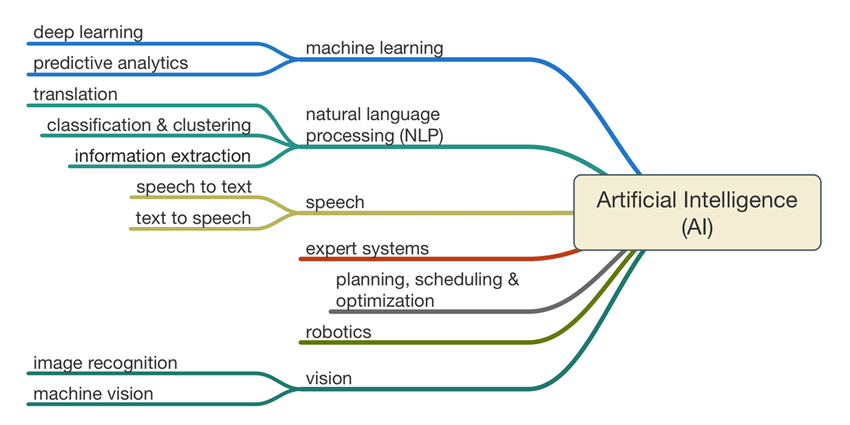
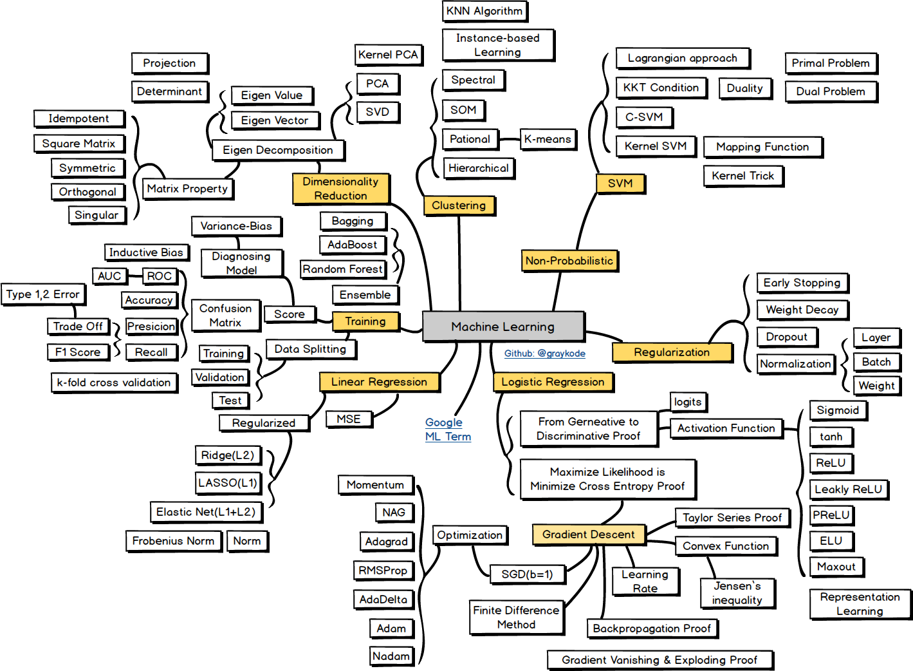
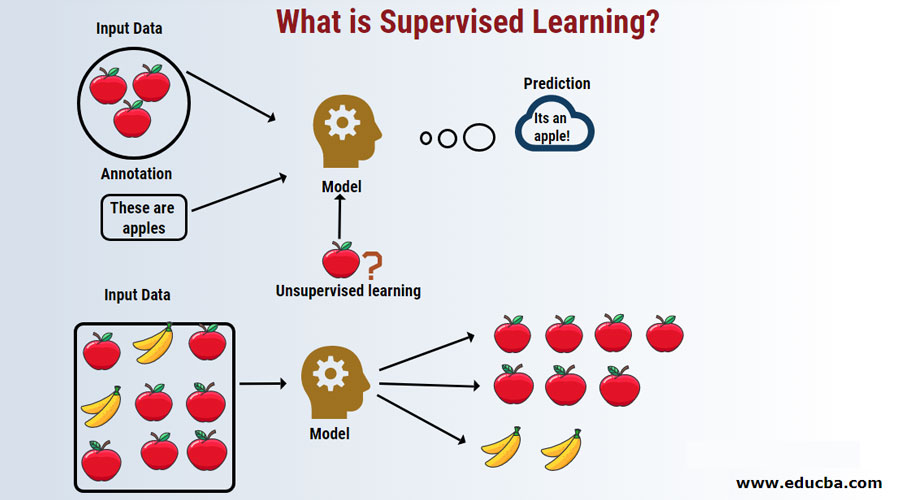
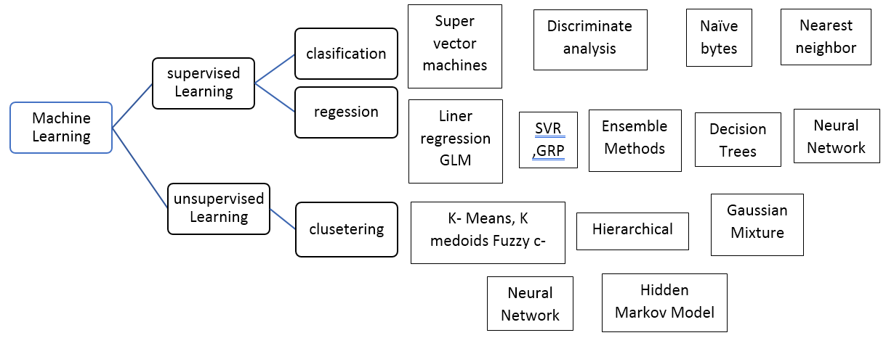

Table of contents
=================

<!--ts-->
   * [Overview ](https://github.com/Laudarisd/Deep-learning-and-ML-preparation)
   * [Machine_Learning_all](https://github.com/Laudarisd/Deep-learning-and-ML-preparation/tree/main/src)
      * [1-Data_Preprocessing](https://github.com/Laudarisd/Deep-learning-and-ML-preparation/tree/main/src/Machine_Learning_all)
<!--te-->

============================================================================================================

============================================================================================================

Overview
================================================

<table border="0">
   <tr>
      <td>
      
      </td>
   </tr>
   </table>
   
   
   
**More Details**

<table border="0">
   <tr>
      <td>
      
      </td>
   </tr>
   </table>

# Basic Needs #

1. Statistics
2. Linear Algebra
3. Calculus
4. Probability
5. Programming Languages

# Which Programming Language #

1. R
2. Python
3. Java

# Which Branch #

1. Supervised Learning
2. Unsupervised Learning
3. Reinforcement Learning

<table border="0">
   <tr>
      <td>
      
      </td>
   </tr>
   </table>

============================================================================================================
   
# Supervised Learning #

Supervised Learning is an area of machine learning where we work on predicting the values using labeled data sets. The labeled input datasets are called the independent variable while the predicted results are called the dependent variable because they depend on the independent variable for their results

<table border="0">
   <tr>
      <td>
      
      </td>
   </tr>
   </table>

   

   
**Types of Supervised Machine Learning Algorithm**

   <table border="0">
   <tr>
      <td>
      
      </td>
   </tr>
   </table>
   
   
**Regression**

Regression is used to predict single value output using the training data set. The output value is always called as the dependent variable while the inputs are known as the independent variable. We have different types of regression in Supervised Learning, for example,

- Linear Regression – Here we have only one independent variable which is used for predicting the output i.e. dependent variable.
- Multiple Regression – Here we have more than one independent variable which is used for predicting the output i.e. the dependent variable.
- Polynomial Regression – Here the graph between the dependent and independent variables follows a polynomial function. For e.g. at first, memory increases with age, then it reaches a threshold at a certain age, and then it starts decreasing as we turn old.

**Classification**

The classification of supervised learning algorithms is used to group similar objects into unique classes.

- Binary classification – If the algorithm is trying to group 2 distinct groups of classes, then it is called binary classification.
- Multiclass classification – If the algorithm is trying to group objects to more than 2 groups, then it is called multiclass classification.
- Strength – Classification algorithms usually perform very well.
- Drawbacks – Prone to overfitting and might be unconstrained. For Example – Email Spam classifier
- Logistic regression/classification – When the Y variable is a binary categorical (i.e. 0 or 1), we use Logistic regression for the prediction. For Example – Predicting if a given credit card transaction is fraud or not.
- Naïve Bayes Classifiers – The Naïve Bayes classifier is based on the Bayesian theorem. This algorithm is usually best suited when the dimensionality of the inputs is high. It consists of acyclic graphs that are having one parent and many children nodes. The child nodes are independent of each other.
- Decision Trees – A decision tree is a tree chart like structure which consists of an internal node (test on attribute), branch which denotes the outcome of the test and the leaf nodes which represents the distribution of classes. The root node is the topmost node. It is a very widely used technique which is used for classification.
- Support Vector Machine – A support vector machine is or an SVM does the job of classification by finding the hyperplane which should maximize the margin between 2 classes. These SVM machines are connected to the kernel functions. Fields, where SVMs are extensively used, are biometrics, pattern recognition, etc.

[Source](https://laptrinhx.com/what-is-supervised-learning-1587450103/)

**Advantages**

Below are some of the advantages of supervised machine learning models:

- The performance of models can be optimized by the user experiences.
- Supervised learning produces outputs using previous experience and also allows you to collect data.
- Supervised machine learning algorithms can be used for implementing a number of real-world problems.

**Disadvantages**

Disadvantages of Supervised Learning are as follow:

- The effort of training supervised machine learning models may take a lot of time if the dataset is bigger.
- The classification of big data sometimes poses a bigger challenge.
- One may have to deal with the problems of overfitting.
- We need lots of good examples if we want the model to perform well while we are training the classifier.

**Good Practices while Building Learning Models**

It is a good practice while building a Supervised Learning Machine Models:-

- Before building any good machine learning model, the process of preprocessing of data must be performed.
- One must decide the algorithm which should be best suited for a given problem.
- We need to decide what type of data will be used for the training set.
- Needs to decide on the structure of the algorithm and function.

