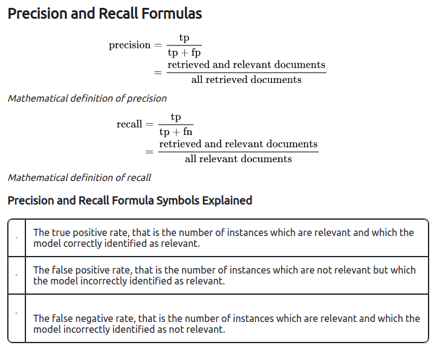
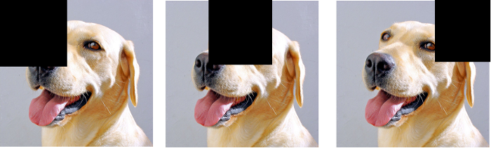

Some common problems and answers
=================================

**1. What is Deep Learning?**

*solution*

Deep Learning involves taking large volumes of structured or unstructured data and using complex algorithms to train neural networks. It performs complex operations to extract hidden patterns and features (for instance, distinguishing the image of a cat from that of a dog

**2. What is Neural Network?**

*solution*

Neural Networks replicate the way humans learn, inspired by how the neurons in our brains fire, only much simpler.

The most common Neural Networks consist of three network layers:

* An input layer
* A hidden layer (this is the most important layer where feature extraction takes place, and adjustments are made to train faster and function better)
* An output layer

**3. What is a Multi-layer Perception(MLP)?**

*solution*

As in Neural Networks, MLPs have an input layer, a hidden layer, and an output layer. It has the same structure as a single layer perceptron with one or more hidden layers. A single layer perceptron can classify only linear separable classes with binary output (0,1), but MLP can classify nonlinear classes.

Except for the input layer, each node in the other layers uses a nonlinear activation function. This means the input layers, the data coming in, and the activation function is based upon all nodes and weights being added together, producing the output. MLP uses a supervised learning method called “backpropagation.” In backpropagation, the neural network calculates the error with the help of cost function. It propagates this error backward from where it came (adjusts the weights to train the model more accurately).

**4. What Is Data Normalization, and Why Do We Need It**

*solution*

The process of standardizing and reforming data is called “Data Normalization.” It’s a pre-processing step to eliminate data redundancy. Often, data comes in, and you get the same information in different formats. In these cases, you should rescale values to fit into a particular range, achieving better convergence.

**5. What is the Boltzmann Machine**

*solution*

One of the most basic Deep Learning models is a Boltzmann Machine, resembling a simplified version of the Multi-Layer Perceptron. This model features a visible input layer and a hidden layer -- just a two-layer neural net that makes stochastic decisions as to whether a neuron should be on or off. Nodes are connected across layers, but no two nodes of the same layer are connected.

**6. What Is the Role of Activation Functions in a Neural Network?**

*solution*

At the most basic level, an activation function decides whether a neuron should be fired or not. It accepts the weighted sum of the inputs and bias as input to any activation function. Step function, Sigmoid, ReLU, Tanh, and Softmax are examples of activation functions.

**7. What Is the Cost Function?**

*solution*

Also referred to as “loss” or “error,” cost function is a measure to evaluate how good your model’s performance is. It’s used to compute the error of the output layer during backpropagation. We push that error backward through the neural network and use that during the different training functions.


**8. What Is Gradient Descent?**

*solution*

Gradient Descent is an optimal algorithm to minimize the cost function or to minimize an error. The aim is to find the local-global minima of a function. This determines the direction the model should take to reduce the error.


**9. What Do You Understand by Backpropagation?**

*solution*

Backpropagation is a technique to improve the performance of the network. It backpropagates the error and updates the weights to reduce the error.


**10. What Is the Difference Between a Feedforward Neural Network and Recurrent Neural Network?**

*solution*

A Feedforward Neural Network signals travel in one direction from input to output. There are no feedback loops; the network considers only the current input. It cannot memorize previous inputs (e.g., CNN).

A Recurrent Neural Network’s signals travel in both directions, creating a looped network. It considers the current input with the previously received inputs for generating the output of a layer and can memorize past data due to its internal memory.


**11. What Are the Applications of a Recurrent Neural Network (RNN)?**

*solution*

The RNN can be used for sentiment analysis, text mining, and image captioning. Recurrent Neural Networks can also address time series problems such as predicting the prices of stocks in a month or quarter.


**12. What Are the Softmax and ReLU Functions?**

*solution*

Softmax is an activation function that generates the output between zero and one. It divides each output, such that the total sum of the outputs is equal to one. Softmax is often used for output layers.

ReLU (or Rectified Linear Unit) is the most widely used activation function. It gives an output of X if X is positive and zeroes otherwise. ReLU is often used for hidden layers.


**13. What Are Hyperparameters?**

*solution*

With neural networks, you’re usually working with hyperparameters once the data is formatted correctly. A hyperparameter is a parameter whose value is set before the learning process begins. It determines how a network is trained and the structure of the network (such as the number of hidden units, the learning rate, epochs, etc.).


**14. What Will Happen If the Learning Rate Is Set Too Low or Too High?**

*solution*

When your learning rate is too low, training of the model will progress very slowly as we are making minimal updates to the weights. It will take many updates before reaching the minimum point.

If the learning rate is set too high, this causes undesirable divergent behavior to the loss function due to drastic updates in weights. It may fail to converge (model can give a good output) or even diverge (data is too chaotic for the network to train).


**15. What Is Dropout and Batch Normalization?**

*solution*

Dropout is a technique of dropping out hidden and visible units of a network randomly to prevent overfitting of data (typically dropping 20 percent of the nodes). It doubles the number of iterations needed to converge the network.

Batch normalization is the technique to improve the performance and stability of neural networks by normalizing the inputs in every layer so that they have mean output activation of zero and standard deviation of one.


**16. What Is the Difference Between Batch Gradient Descent and Stochastic Gradient Descent?**


*solution*

|Batch Gradient Descent  |	Stochastic Gradient Descent|
| :-------------: | :----------: |
|The batch gradient computes the gradient using the entire dataset  |  The stochastic gradient computes the gradient using a single sample|
|It takes time to converge because the volume of data is huge, and weights update slowly | It converges much faster than the batch gradient because it updates weight more frequently |


**17. What is Overfitting and Underfitting, and How to Combat Them?**

*solution*

Overfitting occurs when the model learns the details and noise in the training data to the degree that it adversely impacts the execution of the model on new information. It is more likely to occur with nonlinear models that have more flexibility when learning a target function. An example would be if a model is looking at cars and trucks, but only recognizes trucks that have a specific box shape. It might not be able to notice a flatbed truck because there's only a particular kind of truck it saw in training. The model performs well on training data, but not in the real world.

Underfitting alludes to a model that is neither well-trained on data nor can generalize to new information. This usually happens when there is less and incorrect data to train a model. Underfitting has both poor performance and accuracy.

To combat overfitting and underfitting, you can resample the data to estimate the model accuracy (k-fold cross-validation) and by having a validation dataset to evaluate the model.


**18. How Are Weights Initialized in a Network?**

*solution*

There are two methods here: we can either initialize the weights to zero or assign them randomly.

Initializing all weights to 0: This makes your model similar to a linear model. All the neurons and every layer perform the same operation, giving the same output and making the deep net useless.

Initializing all weights randomly: Here, the weights are assigned randomly by initializing them very close to 0. It gives better accuracy to the model since every neuron performs different computations. This is the most commonly used method.


**19. What Are the Different Layers on CNN?**

*solution*

There are four layers in CNN:

* Convolutional Layer -  the layer that performs a convolutional operation, creating several smaller picture windows to go over the data.
* ReLU Layer - it brings non-linearity to the network and converts all the negative pixels to zero. The output is a rectified feature map.
* Pooling Layer - pooling is a down-sampling operation that reduces the dimensionality of the feature map.
* Fully Connected Layer - this layer recognizes and classifies the objects in the image.


**20. What is Pooling on CNN, and How Does It Work?**

*solution*

Pooling is used to reduce the spatial dimensions of a CNN. It performs down-sampling operations to reduce the dimensionality and creates a pooled feature map by sliding a filter matrix over the input matrix.


**21. How Does an LSTM Network Work?**

*solution*

Long-Short-Term Memory (LSTM) is a special kind of recurrent neural network capable of learning long-term dependencies, remembering information for long periods as its default behavior. There are three steps in an LSTM network:

* Step 1: The network decides what to forget and what to remember.
* Step 2: It selectively updates cell state values.
* Step 3: The network decides what part of the current state makes it to the output.


**22. What Are Vanishing and Exploding Gradients?**

*solution*

While training an RNN, your slope can become either too small or too large; this makes the training difficult. When the slope is too small, the problem is known as a “Vanishing Gradient.” When the slope tends to grow exponentially instead of decaying, it’s referred to as an “Exploding Gradient.” Gradient problems lead to long training times, poor performance, and low accuracy.

**23. What Is the Difference Between Epoch, Batch, and Iteration in Deep Learning?**

*solution*

* Epoch - Represents one iteration over the entire dataset (everything put into the training model).
* Batch - Refers to when we cannot pass the entire dataset into the neural network at once, so we divide the dataset into several batches.
* Iteration - if we have 10,000 images as data and a batch size of 200. then an epoch should run 50 iterations (10,000 divided by 50).


**24. Why is Tensorflow the Most Preferred Library in Deep Learning?**

*solution*

Tensorflow provides both C++ and Python APIs, making it easier to work on and has a faster compilation time compared to other Deep Learning libraries like Keras and Torch. Tensorflow supports both CPU and GPU computing devices

**25. What Do You Mean by Tensor in Tensorflow?**

*solution*

A tensor is a mathematical object represented as arrays of higher dimensions. These arrays of data with different dimensions and ranks fed as input to the neural network are called “Tensors.”


**26. What Are the Programming Elements in Tensorflow?**

*solution*

Constants - Constants are parameters whose value does not change. To define a constant we use  tf.constant() command. For example:
```
a = tf.constant(2.0,tf.float32)

b = tf.constant(3.0)

Print(a, b)
```

Variables - Variables allow us to add new trainable parameters to graph. To define a variable, we use the tf.Variable() command and initialize them before running the graph in a session. An example:
```
W = tf.Variable([.3].dtype=tf.float32)

b = tf.Variable([-.3].dtype=tf.float32)
```

Placeholders - these allow us to feed data to a tensorflow model from outside a model. It permits a value to be assigned later. To define a placeholder, we use the tf.placeholder() command. An example:
```
a = tf.placeholder (tf.float32)

b = a*2

with tf.Session() as sess:

result = sess.run(b,feed_dict={a:3.0})

print result
```

Sessions - a session is run to evaluate the nodes. This is called the “Tensorflow runtime.” For example:

```
a = tf.constant(2.0)

b = tf.constant(4.0)

c = a+b

# Launch Session

Sess = tf.Session()

# Evaluate the tensor c

print(sess.run(c))
```

**27. Explain a Computational Graph.**

*solution*

Everything in a tensorflow is based on creating a computational graph. It has a network of nodes where each node operates, Nodes represent mathematical operations, and edges represent tensors. Since data flows in the form of a graph, it is also called a “DataFlow Graph.”


**28. Explain Generative Adversarial Network.**

*solution*

Suppose there is a wine shop purchasing wine from dealers, which they resell later. But some dealers sell fake wine. In this case, the shop owner should be able to distinguish between fake and authentic wine.

The forger will try different techniques to sell fake wine and make sure specific techniques go past the shop owner’s check. The shop owner would probably get some feedback from wine experts that some of the wine is not original. The owner would have to improve how he determines whether a wine is fake or authentic.

The forger’s goal is to create wines that are indistinguishable from the authentic ones while the shop owner intends to tell if the wine is real or not accurately.


**29. What Is an Auto-encoder?**

*solution*

This Neural Network has three layers in which the input neurons are equal to the output neurons. The network's target outside is the same as the input. It uses dimensionality reduction to restructure the input. It works by compressing the image input to a latent space representation then reconstructing the output from this representation.


**30. What Is Bagging and Boosting?**

*solution*

Bagging and Boosting are ensemble techniques to train multiple models using the same learning algorithm and then taking a call.

With Bagging, we take a dataset and split it into training data and test data. Then we randomly select data to place into the bags and train the model separately.

With Boosting, the emphasis is on selecting data points which give wrong output to improve the accuracy.


**31. What is batch normalization?**

*solution*

**32. How does YOLO work?**

*solution*

**33. What is the difference between R-CNN and CNN?**

*solution*

**34. Why do we need pretrain model?**

*solution*

**35. Explain the architecture of pretrain model(Resnet, mobilenet, etc).**

*solution*

**36. What are supervised and unsupervised learning algorithms in deep learning?**


*solution*

Supervised learning requires training labeled data. For example, in order to do classification (a supervised learning task), you’ll need to first label the data you’ll use to train the model to classify data into your labeled groups. Unsupervised learning, in contrast, does not require labeling data explicitly.


**37. What’s the trade-off between bias and variance?**

*solution*

Bias is error due to erroneous or overly simplistic assumptions in the learning algorithm you’re using. This can lead to the model underfitting your data, making it hard for it to have high predictive accuracy and for you to generalize your knowledge from the training set to the test set.


Variance is error due to too much complexity in the learning algorithm you’re using. This leads to the algorithm being highly sensitive to high degrees of variation in your training data, which can lead your model to overfit the data. You’ll be carrying too much noise from your training data for your model to be very useful for your test data.

The bias-variance decomposition essentially decomposes the learning error from any algorithm by adding the bias, the variance and a bit of irreducible error due to noise in the underlying dataset. Essentially, if you make the model more complex and add more variables, you’ll lose bias but gain some variance — in order to get the optimally reduced amount of error, you’ll have to tradeoff bias and variance. You don’t want either high bias or high variance in your model.


**38. How is KNN different from k-means clustering?**

*solution*

K-Nearest Neighbors is a supervised classification algorithm, while k-means clustering is an unsupervised clustering algorithm. While the mechanisms may seem similar at first, what this really means is that in order for K-Nearest Neighbors to work, you need labeled data you want to classify an unlabeled point into (thus the nearest neighbor part). K-means clustering requires only a set of unlabeled points and a threshold: the algorithm will take unlabeled points and gradually learn how to cluster them into groups by computing the mean of the distance between different points.

The critical difference here is that KNN needs labeled points and is thus supervised learning, while k-means doesn’t—and is thus unsupervised learning.


**39. Explain how a ROC curve works.**

*solution*

The ROC curve is a graphical representation of the contrast between true positive rates and the false positive rate at various thresholds. It’s often used as a proxy for the trade-off between the sensitivity of the model (true positives) vs the fall-out or the probability it will trigger a false alarm (false positives).

**40. Define precision and recall.**

*solution*

Recall is also known as the true positive rate: the amount of positives your model claims compared to the actual number of positives there are throughout the data. Precision is also known as the positive predictive value, and it is a measure of the amount of accurate positives your model claims compared to the number of positives it actually claims. It can be easier to think of recall and precision in the context of a case where you’ve predicted that there were 10 apples and 5 oranges in a case of 10 apples. You’d have perfect recall (there are actually 10 apples, and you predicted there would be 10) but 66.7% precision because out of the 15 events you predicted, only 10 (the apples) are correct


<table border="0">
   <tr>
      <td>
      
      </td>
   </tr>
   </table>


**41. Explain stride.**

*solution*

Stride is a component of convolutional neural networks, or neural networks tuned for the compression of images and video data. Stride is a parameter of the neural network's filter that modifies the amount of movement over the image or video. For example, if a neural network's stride is set to 1, the filter will move one pixel, or unit,  at a time. The size of the filter affects the encoded output volume, so stride is often set to a whole integer, rather than a fraction or decimal.


**42. What is Bayes’ Theorem? How is it useful in a machine learning context?**

*solution*

Bayes’ Theorem gives you the posterior probability of an event given what is known as prior knowledge.

Mathematically, it’s expressed as the true positive rate of a condition sample divided by the sum of the false positive rate of the population and the true positive rate of a condition. Say you had a 60% chance of actually having the flu after a flu test, but out of people who had the flu, the test will be false 50% of the time, and the overall population only has a 5% chance of having the flu. Would you actually have a 60% chance of having the flu after having a positive test?

Bayes’ Theorem says no. It says that you have a (.6 * 0.05) (True Positive Rate of a Condition Sample) / (.6*0.05)(True Positive Rate of a Condition Sample) + (.5*0.95) (False Positive Rate of a Population)  = 0.0594 or 5.94% chance of getting a flu.

Bayes’ Theorem is the basis behind a branch of machine learning that most notably includes the Naive Bayes classifier. That’s something important to consider when you’re faced with machine learning interview questions.


**43. Why is “Naive” Bayes naive?**

*solution*

Despite its practical applications, especially in text mining, Naive Bayes is considered “Naive” because it makes an assumption that is virtually impossible to see in real-life data: the conditional probability is calculated as the pure product of the individual probabilities of components. This implies the absolute independence of features — a condition probably never met in real life.

As a Quora commenter put it whimsically, a Naive Bayes classifier that figured out that you liked pickles and ice cream would probably naively recommend you a pickle ice cream.


**44. Explain the difference between L1 and L2 regularization.**

*solution*

 L2 regularization tends to spread error among all the terms, while L1 is more binary/sparse, with many variables either being assigned a 1 or 0 in weighting. L1 corresponds to setting a Laplacean prior on the terms, while L2 corresponds to a Gaussian prior.

**45. What’s your favorite algorithm, and can you explain it to me in less **than a minute?**

*solution*

**46. What’s the difference between Type I and Type II error?**

*solution*

Type I error is a false positive, while Type II error is a false negative. Briefly stated, Type I error means claiming something has happened when it hasn’t, while Type II error means that you claim nothing is happening when in fact something is.

A clever way to think about this is to think of Type I error as telling a man he is pregnant, while Type II error means you tell a pregnant woman she isn’t carrying a baby.


**47. What’s a Fourier transform?**

*solution*

A Fourier transform is a generic method to decompose generic functions into a superposition of symmetric functions. Or as this more intuitive tutorial puts it, given a smoothie, it’s how we find the recipe. The Fourier transform finds the set of cycle speeds, amplitudes, and phases to match any time signal. A Fourier transform converts a signal from time to frequency domain—it’s a very common way to extract features from audio signals or other time series such as sensor data.


**48. What’s the difference between probability and likelihood?**

*solution*

**49. What’s the difference between a generative and discriminative model?**

*solution*

A generative model will learn categories of data while a discriminative model will simply learn the distinction between different categories of data. Discriminative models will generally outperform generative models on classification tasks.

**50. What is cross-validation? What cross-validation technique would you use on a time series dataset?**

*solution*

 Instead of using standard k-folds cross-validation, you have to pay attention to the fact that a time series is not randomly distributed data—it is inherently ordered by chronological order. If a pattern emerges in later time periods, for example, your model may still pick up on it even if that effect doesn’t hold in earlier years!

You’ll want to do something like forward chaining where you’ll be able to model on past data then look at forward-facing data.

- Fold 1 : training [1], test [2]
- Fold 2 : training [1 2], test [3]
- Fold 3 : training [1 2 3], test [4]
- Fold 4 : training [1 2 3 4], test [5]
- Fold 5 : training [1 2 3 4 5], test [6]


**51. How is a decision tree pruned?**

*solution*

Pruning is what happens in decision trees when branches that have weak predictive power are removed in order to reduce the complexity of the model and increase the predictive accuracy of a decision tree model. Pruning can happen bottom-up and top-down, with approaches such as reduced error pruning and cost complexity pruning.

Reduced error pruning is perhaps the simplest version: replace each node. If it doesn’t decrease predictive accuracy, keep it pruned. While simple, this heuristic actually comes pretty close to an approach that would optimize for maximum accuracy.


**52. Which is more important to you: model accuracy or model performance?**

*solution*


**53. What’s the F1 score? How would you use it?**

*solution*

The F1 score is a measure of a model’s performance. It is a weighted average of the precision and recall of a model, with results tending to 1 being the best, and those tending to 0 being the worst. You would use it in classification tests where true negatives don’t matter much.


**54. How would you handle an imbalanced dataset?**

*solution*

An imbalanced dataset is when you have, for example, a classification test and 90% of the data is in one class. That leads to problems: an accuracy of 90% can be skewed if you have no predictive power on the other category of data! Here are a few tactics to get over the hump:

* Collect more data to even the imbalances in the dataset.
* Resample the dataset to correct for imbalances.
* Try a different algorithm altogether on your dataset.

**55. When should you use classification over regression?**

*solution*

Classification produces discrete values and dataset to strict categories, while regression gives you continuous results that allow you to better distinguish differences between individual points. You would use classification over regression if you wanted your results to reflect the belongingness of data points in your dataset to certain explicit categories (ex: If you wanted to know whether a name was male or female rather than just how correlated they were with male and female names.)


**56. Name an example where ensemble techniques might be useful.**

*solution*

 Ensemble techniques use a combination of learning algorithms to optimize better predictive performance. They typically reduce overfitting in models and make the model more robust (unlikely to be influenced by small changes in the training data). 

You could list some examples of ensemble methods (bagging, boosting, the “bucket of models” method) and demonstrate how they could increase predictive power.

**57. How do you ensure you’re not overfitting with a model?**

*solution*

This is a simple restatement of a fundamental problem in machine learning: the possibility of overfitting training data and carrying the noise of that data through to the test set, thereby providing inaccurate generalizations.

There are three main methods to avoid overfitting:

* Keep the model simpler: reduce variance by taking into account fewer variables and parameters, thereby removing some of the noise in the training data.
* Use cross-validation techniques such as k-folds cross-validation.
* Use regularization techniques such as LASSO that penalize certain model parameters if they’re likely to cause overfitting.


**58. How would you evaluate a logistic regression model?**

*solution*

**59. What’s the “kernel trick” and how is it useful?**

*solution*

The Kernel trick involves kernel functions that can enable in higher-dimension spaces without explicitly calculating the coordinates of points within that dimension: instead, kernel functions compute the inner products between the images of all pairs of data in a feature space. This allows them the very useful attribute of calculating the coordinates of higher dimensions while being computationally cheaper than the explicit calculation of said coordinates. Many algorithms can be expressed in terms of inner products. Using the kernel trick enables us effectively run algorithms in a high-dimensional space with lower-dimensional data.


**60. Pick an algorithm. Write the pseudo-code for a parallel implementation.**

*solution*

This kind of question demonstrates your ability to think in parallelism and how you could handle concurrency in programming implementations dealing with big data. Take a look at pseudocode frameworks such as Peril-L and visualization tools such as Web Sequence Diagrams to help you demonstrate your ability to write code that reflects parallelism.


**61. What are some differences between a linked list and an array?**

*solution*

An array is an ordered collection of objects. A linked list is a series of objects with pointers that direct how to process them sequentially. An array assumes that every element has the same size, unlike the linked list. A linked list can more easily grow organically: an array has to be pre-defined or re-defined for organic growth. Shuffling a linked list involves changing which points direct where—meanwhile, shuffling an array is more complex and takes more memory.

**62. Which data visualization libraries do you use? What are your thoughts on the best data visualization tools?**

*solution*

What’s important here is to define your views on how to properly visualize data and your personal preferences when it comes to tools. Popular tools include R’s ggplot, Python’s seaborn and matplotlib, and tools such as Plot.ly and Tableau.

**63. Given two strings, A and B, of the same length n, find whether it is **possible to cut both strings at a common point such that the first part of A and the second part  of B form a palindrome.**

*solution*

You’ll often get standard algorithms and data structures questions as part of your interview process as a machine learning engineer that might feel akin to a software engineering interview. In this case, this comes from Google’s interview process. There are multiple ways to check for palindromes—one way of doing so if you’re using a programming language such as Python is to reverse the string and check to see if it still equals the original string, for example. The thing to look out for here is the category of questions you can expect, which will be akin to software engineering questions that drill down to your knowledge of algorithms and data structures. Make sure that you’re totally comfortable with the language of your choice to express that logic.


**64. How are primary and foreign keys related in SQL?**

*solution*

Most machine learning engineers are going to have to be conversant with a lot of different data formats. SQL is still one of the key ones used. Your ability to understand how to manipulate SQL databases will be something you’ll most likely need to demonstrate. In this example, you can talk about how foreign keys allow you to match up and join tables together on the primary key of the corresponding table—but just as useful is to talk through how you would think about setting up SQL tables and querying them.


**65. How does XML and CSVs compare in terms of size?**

*solution*

In practice, XML is much more verbose than CSVs are and takes up a lot more space. CSVs use some separators to categorize and organize data into neat columns. XML uses tags to delineate a tree-like structure for key-value pairs. You’ll often get XML back as a way to semi-structure data from APIs or HTTP responses. In practice, you’ll want to ingest XML data and try to process it into a usable CSV. This sort of question tests your familiarity with data wrangling sometimes messy data formats.

**66. What are the data types supported by JSON?**

*solution*

This tests your knowledge of JSON, another popular file format that wraps with JavaScript. There are six basic JSON datatypes you can manipulate: strings, numbers, objects, arrays, booleans, and null values. 

**67. How would you build a data pipeline?**

*solution*

 Data pipelines are the bread and butter of machine learning engineers, who take data science models and find ways to automate and scale them. Make sure you’re familiar with the tools to build data pipelines (such as Apache Airflow) and the platforms where you can host models and pipelines (such as Google Cloud or AWS or Azure). Explain the steps required in a functioning data pipeline and talk through your actual experience building and scaling them in production. 

**68. How do you think Google is training data for self-driving cars?**

*solution*

Machine learning interview questions like this one really test your knowledge of different machine learning methods, and your inventiveness if you don’t know the answer. Google is currently using recaptcha to source labeled data on storefronts and traffic signs. They are also building on training data collected by Sebastian Thrun at GoogleX—some of which was obtained by his grad students driving buggies on desert dunes!

**69. How would you simulate the approach AlphaGo took to beat Lee Sedol at Go?**

*solution*

AlphaGo beating Lee Sedol, the best human player at Go, in a best-of-five series was a truly seminal event in the history of machine learning and deep learning. The Nature paper above describes how this was accomplished with “Monte-Carlo tree search with deep neural networks that have been trained by supervised learning, from human expert games, and by reinforcement learning from games of self-play.”


**70. What are your thoughts on GPT-3 and OpenAI’s model?**

*solution*

 GPT-3 is a new language generation model developed by OpenAI. It was marked as exciting because with very little change in architecture, and a ton more data, GPT-3 could generate what seemed to be human-like conversational pieces, up to and including novel-size works and the ability to create code from natural language. There are many perspectives on GPT-3 throughout the Internet — if it comes up in an interview setting, be prepared to address this topic (and trending topics like it) intelligently to demonstrate that you follow the latest advances in machine learning. 

**71. What models do you train for fun, and what GPU/hardware do you use?**

*solution*

This question tests whether you’ve worked on machine learning projects outside of a corporate role and whether you understand the basics of how to resource projects and allocate GPU-time efficiently. Expect questions like this to come from hiring managers that are interested in getting a greater sense behind your portfolio, and what you’ve done independently.


**72. What are some of your favorite APIs to explore?**

*solution*

[click](https://github.com/Laudarisd/Awesome_APIs)

**73. Why is it necessary to introduce non-linearities in a neural network?**

*solution*

otherwise, we would have a composition of linear functions, which is also a linear function, giving a linear model. A linear model has a much smaller number of parameters, and is therefore limited in the complexity it can model.

**74. Describe two ways of dealing with the vanishing gradient problem in a neural network.**

*Solution:*

* Using ReLU activation instead of sigmoid.
* Using Xavier initialization.

**75. What are some advantages in using a CNN (convolutional neural network) rather than a DNN (dense neural network) in an image classification task?**

*Solution:*

while both models can capture the relationship between close pixels, CNNs have the following properties:
* It is translation invariant — the exact location of the pixel is irrelevant for the filter.
* It is less likely to overfit — the typical number of parameters in a CNN is much smaller than that of a DNN.
* Gives us a better understanding of the model — we can look at the filters’ weights and visualize what the network “learned”.
* Hierarchical nature — learns patterns in by describing complex patterns using simpler ones.

**76. Describe two ways to visualize features of a CNN in an image classification task.**

*Solution:*

* Input occlusion — cover a part of the input image and see which part affect the classification the most. For instance, given a trained image classification model, give the images below as input. If, for instance, we see that the 3rd image is classified with 98% probability as a dog, while the 2nd image only with 65% accuracy, it means that

<table border="0">
   <tr>
      <td>-------------------------------------------
      
      </td>
   </tr>
   </table>


* Activation Maximization — the idea is to create an artificial input image that maximize the target response (gradient ascent).

**77. Is trying the following learning rates: 0.1,0.2,…,0.5 a good strategy to optimize the learning rate?**

*Solution:* No, it is recommended to try a logarithmic scale to optimize the learning rate.

**78. Suppose you have a NN with 3 layers and ReLU activations. What will happen if we initialize all the weights with the same value? what if we only had 1 layer (i.e linear/logistic regression?)**

*Solution:*

If we initialize all the weights to be the same we would not be able to break the symmetry; i.e, all gradients will be updated the same and the network will not be able to learn. In the 1-layers scenario, however, the cost function is convex (linear/sigmoid) and thus the weights will always converge to the optimal point, regardless of the initial value (convergence may be slower).

**79. Explain the idea behind the Adam optimizer.**

*Solution:*

Adam, or adaptive momentum, combines two ideas to improve convergence: per-parameter updates which give faster convergence, and momentum which helps to avoid getting stuck in saddle point.

**80. What is saddle point?**

*Solution*


**81. Compare batch, mini-batch and stochastic gradient descent.**

*Solution:*

 batch refers to estimating the data by taking the entire data, mini-batch by sampling a few datapoints, and SGD refers to update the gradient one datapoint at each epoch. The tradeoff here is between how precise the calculation of the gradient is versus what size of batch we can keep in memory. Moreover, taking mini-batch rather than the entire batch has a regularizing effect by adding random noise at each epoch.

**82. What is data augmentation? Give examples.**

*Solution:* 

Data augmentation is a technique to increase the input data by performing manipulations on the original data. For instance in images, one can: rotate the image, reflect (flip) the image, add Gaussian blur


[click](https://www.simplilearn.com/tutorials/deep-learning-tutorial/deep-learning-interview-questions)

[click](https://www.springboard.com/blog/machine-learning-interview-questions/)

[click](https://towardsdatascience.com/50-deep-learning-interview-questions-part-1-2-8bbc8a00ec61)
