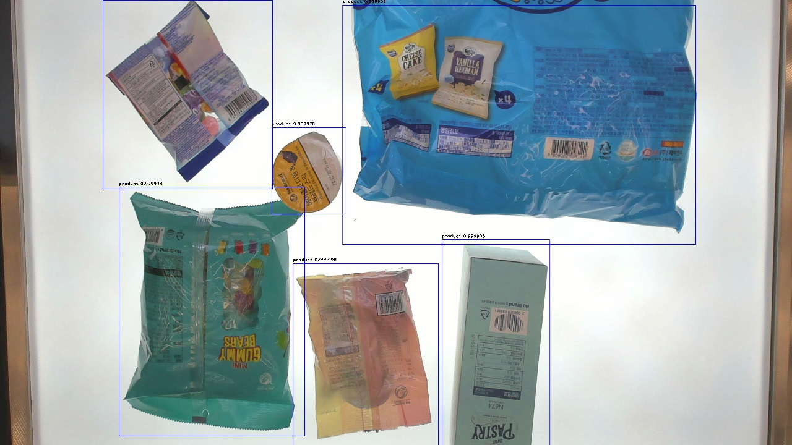
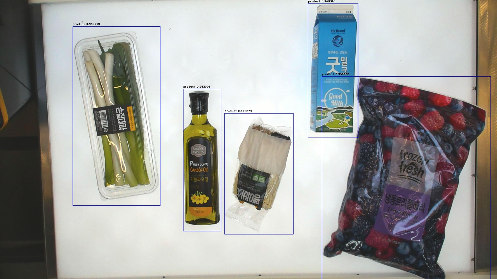
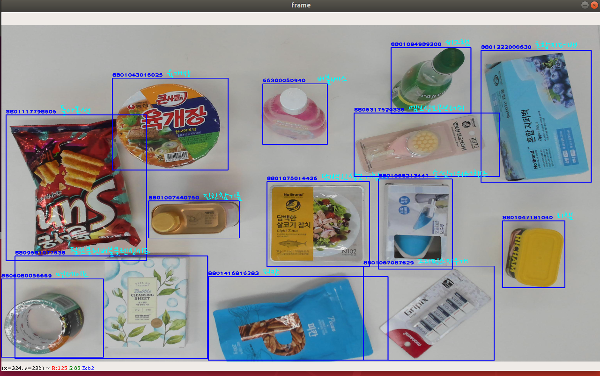
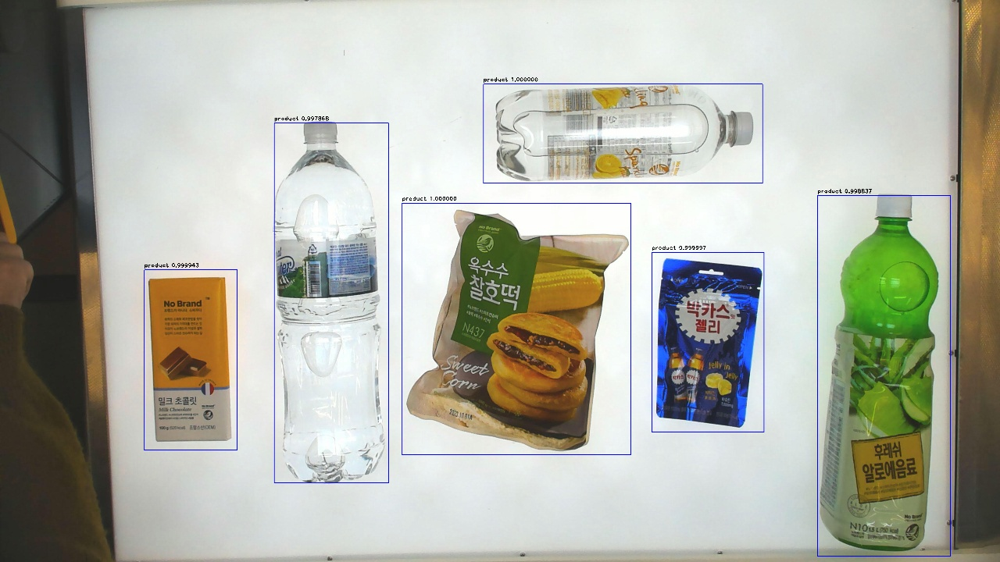
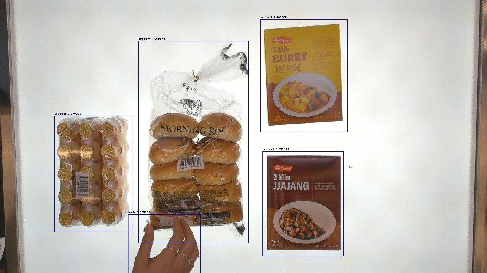
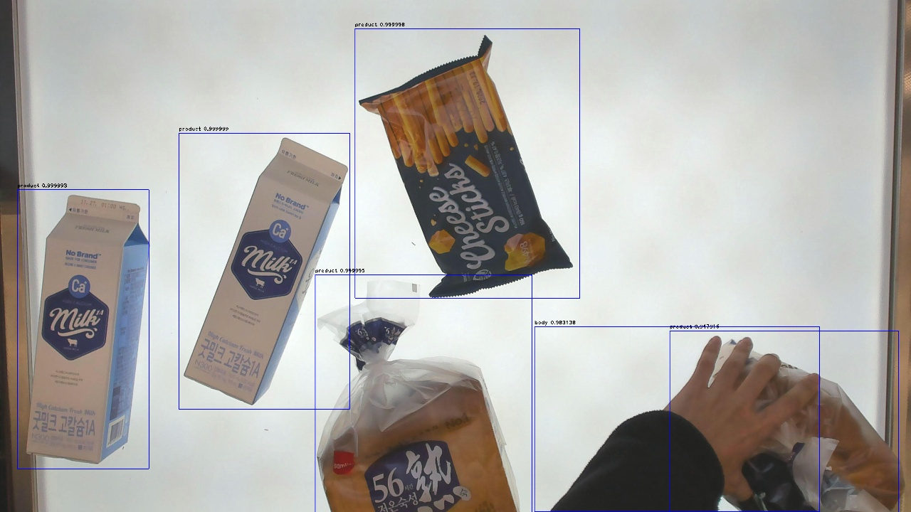
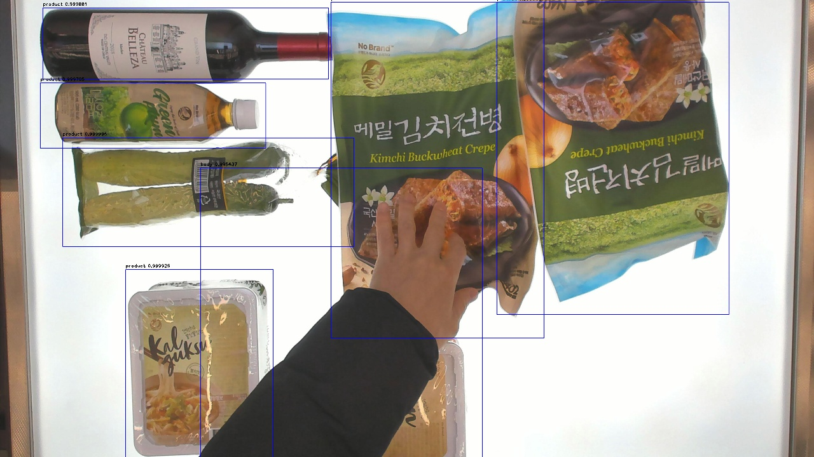
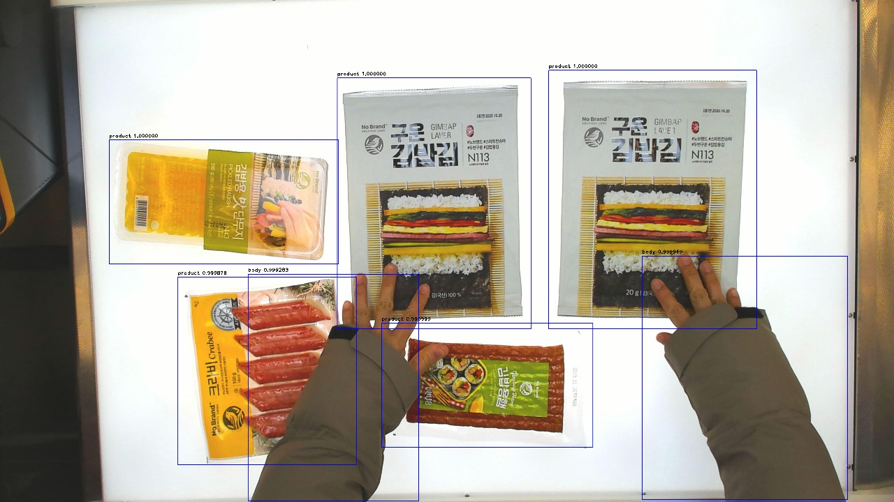

Checkout_Table
============

**Detecting Objects in Checkout table**

Table of contents
==================

<!--ts-->
* [Overview](#Overview)
    * [Framework](#Framework)

   
<!--te-->

Overview
===========

**Detecting only product**

<table border="0">
   <tr>
      <td>
      
      </td>
      <td>
      
      </td>
      <td>
      
      </td>
      <td>
      
      </td>
   </tr>
   </table>

**Detecting product and body**

<table border="0">
   <tr>
      <td>
      
      </td>
      <td>
      
      </td>
      <td>
      
      </td>
      <td>
      
      </td>
   </tr>
   </table>

**project is going on **

 
 
 
