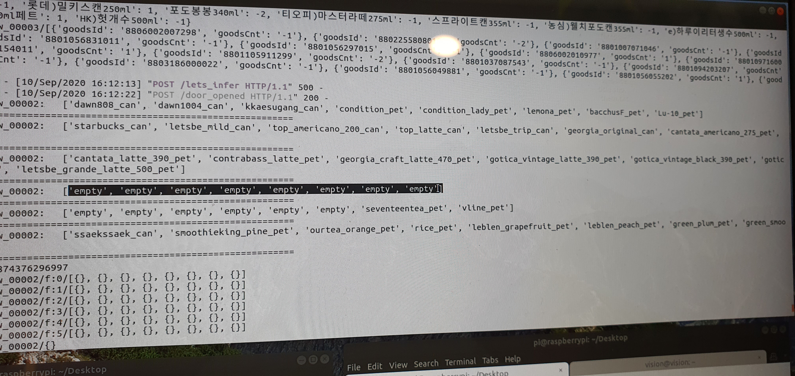

Smart Retail project 
============

**In this project, we developed a smart refrigerator**


Project detail is explained in the following section


Table of contents
==================

<!--ts-->
* [Integration](#Integration)
    * [Raspberri_pi](#Raspberri_pi)
    * [Camera](#Camera)
    * [Load_Cell](#Load_Cell)
* [Test](#Test)
* [Others](#Others)
    * [DB_AWS](#DB_AWS )
    * [Close_open_api](#Close_open_api)
    * [Computer_vision](#Computer_vision)
   
<!--te-->


Integration
===========

In this project, we integrated load cell, cameras, raspberry pi to make a smart refrigerator like Amazon's smart convenience store.

<table border="0">
   <tr>
      <td>
      
      </td>
   </tr>
   </table>


Raspberri_pi
=============

First step is to setup raspberry pi to each floors and conect to internet so that we can use ip address to connet with `master server` and `redis server`.


Camera
=======

After completing reaspberry pi setup, we adjust cameras in each floor and connect to raspberry pi. Based on our requirement, we setup cameras in different angles. positions.

`Master respberry pi` handles all captures in sub raspberry pi and sends all images to redis to test image `classification` model. [`Camera python file`]() setup :

**Some setting in rasppery pi cam**

```
r = redis.Redis(host='ip',
                port= port id ,
                db=2,
                username='username',
                password=keys.get('redis', os.path.join(os.path.dirname(sys.argv[0]), 'keys')))
```


```
def cam_set(cap):
    width = 3840
    height = 2160
    
    cap_AUTOFOCUS = 0
    cap_FOCUS = 0
    
    #cap.set(cv2.CAP_PROP_FOURCC, MJPG_CODEC)
    cap.set(cv2.CAP_PROP_AUTOFOCUS, cap_AUTOFOCUS)
    cap.set(cv2.CAP_PROP_FOCUS, cap_FOCUS)
    
    cap.set(cv2.CAP_PROP_FRAME_WIDTH, width)
    cap.set(cv2.CAP_PROP_FRAME_HEIGHT, height)
    cap.read()

def cam_list():
    # check cam plugged in
    camera_list = []
    get_all_device_list = Popen(["v4l2-ctl --list-devices"], shell=True, stdout=PIPE, encoding="utf-8")
    stdout, stderr = get_all_device_list.communicate()
    get_all_device_list = stdout.split('\n\n')
    for i in get_all_device_list:
        if "bcm2835-codec-decode" in i:
            continue
        if i != '':
            item = i.split('\n\t')
            camera_list.append(item[1])
    print(camera_list)
    return camera_list
    
   ```

Load_Cell
==========

Since each floor of each refrigerator has 8 columns with different products, we used load cell to optimize the weight of each columns separately. Sample images of floors are shown below. 

**Images**

We setup raspberri pi in each floor. Each raspberry pi has a python file which gives an information of weight and sends to redis server to analyze the output with deep learning model's result. 

Connecting with server and getting ip: 

```
#-*- coding: utf-8 -*-
import re
import json
import redis
import config
import socket
import serial
from keys import keys
from multiprocessing import Process

r = redis.Redis(host='  ip ', port=6379, db=2,
                username='worker', password=keys.get('redis', './keys'))

PORT = '/dev/ttyUSB0'
BAUDRATE = 38400
ser = serial.Serial(PORT, BAUDRATE, timeout=1)

# get ip
s = socket.socket(socket.AF_INET, socket.SOCK_DGRAM)
s.connect(("8.8.8.8", 80))
get_eth0_ip = s.getsockname()[0]
ip_end = get_eth0_ip.split('.')[-1]
s.close()
```

Similarly we define the device id:

```
store_id = config.refrigerators['storeId']
for d in config.refrigerators['device_list']:
    if ip_end in d['floors'].keys():
        device_id = d['deviceId']
        floor = d['floors'][ip_end]
```

After completing setup, we do [calibration]()


**Sample images**

<table border="0">
   <tr>
      <td>
      
      </td>
      <td>
      
      </td>
   </tr>
   </table>


Test
=====
 Main part of the project is to combine two results (load cell and AI) and visualize it on the GUI when customer buys something.
On the screen we gave positive value for buying products and negative value for returning products.

**Images**

<table border="0">
   <tr>
      <td>
      
      </td>
      <td>
      
      </td>
   </tr>
   </table>

-First image - We can see that  `2 mountain can (power can )` are removed from the second floor 1st position. 
-Second image - We can see `negative value` while products are return.


Another part of the project is to detect empty columns. 

**Images**
 
In the following image, we can see that 4th and 5th columns are empty.

<table border="0">
   <tr>
      <td>
      
      </td>
   </tr>
   </table>


We used `image classification` model [`efficientnet`]() to classify products of each columns. We only classify the front line of each floor. 


**Images**

Others
========


* DB_AWS
* Close_open_api
* Computer_vision


**project is going on **


 
 
 
