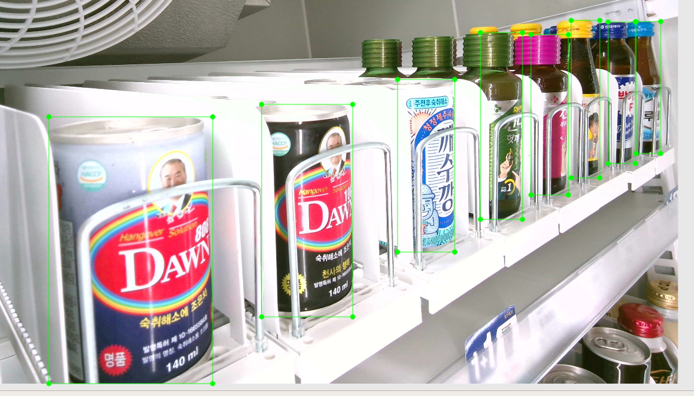
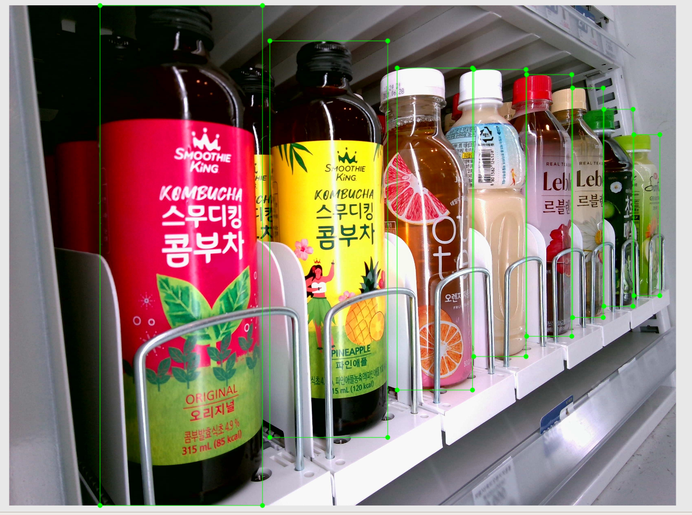
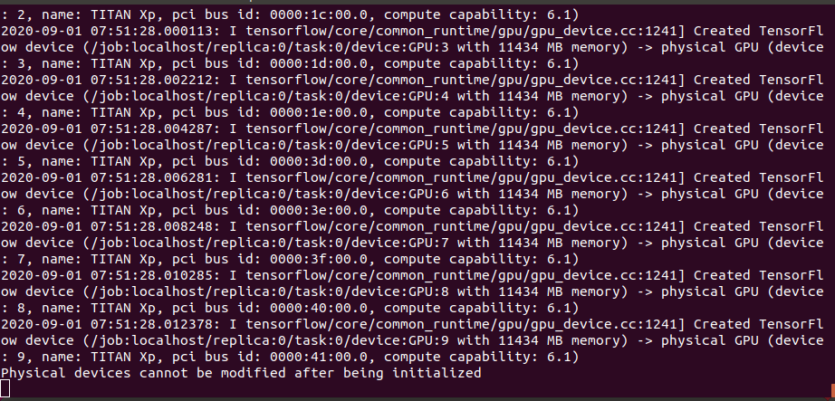
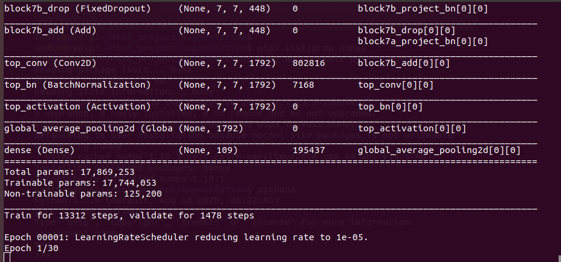
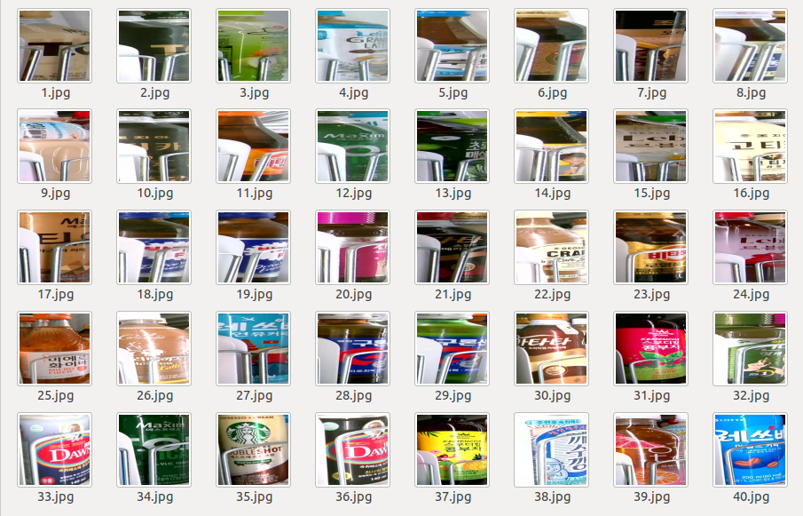
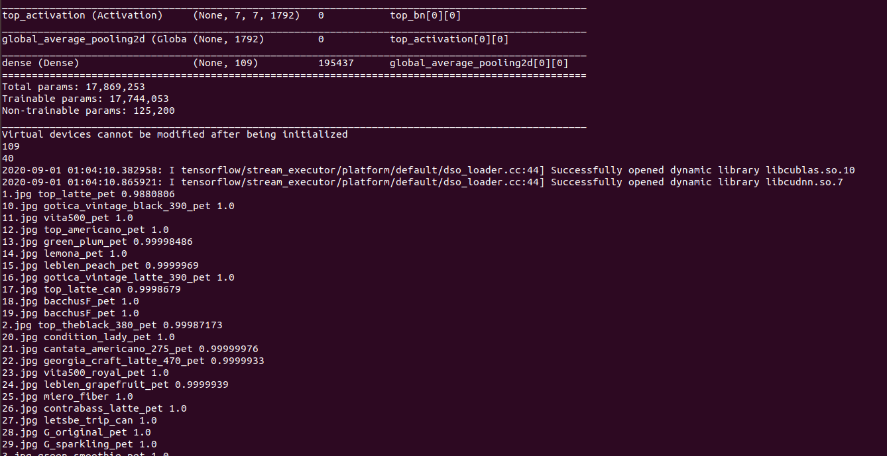
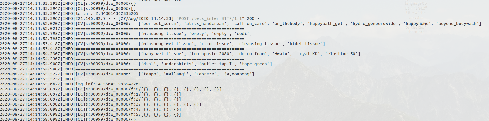
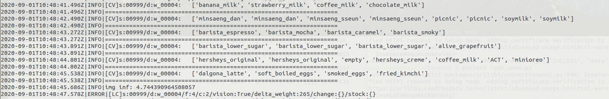
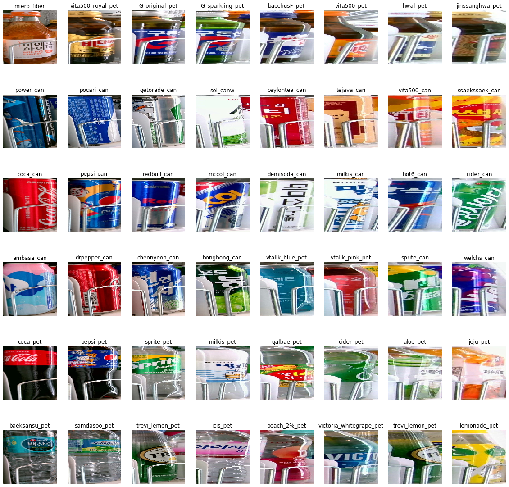
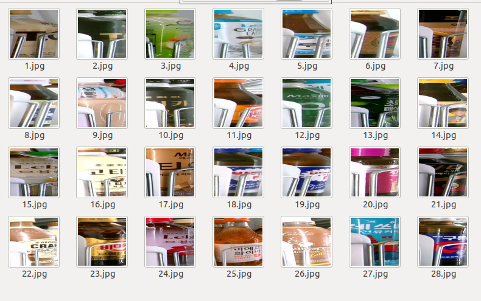

Image Classification
===========
A common use of machine learning is to identify what an image represents. For example, we might want to know what type of animal appears in the following photograph.

The task of predicting what an image represents is called image classification. An image classification model is trained to recognize various classes of images. For example, a model might be trained to recognize photos representing three different types of animals: rabbits, hamsters, and dogs.

When we subsequently provide a new image as input to the model, it will output the probabilities of the image representing each of the types of animal it was trained on. An example output might be as follows:


|Label     |	Probability|
| :-------------: | :----------: |
|rabbit  |	0.07|
|hamster |	0.02|
|dog     |	0.91 | 


For more information [click here](https://www.tensorflow.org/lite/models/image_classification/overview#what_is_image_classification)


In this project, I used custom datasets to train and test the image classification model.
Detail of the project is given below:
   


Table of contents
==================

<!--ts-->
* [Source](#Source)
    * [Setup](#Setup)
    * [Data_collection](#Data_collection)
    * [Data_pre-processing](#Data_pre-processing)
    * [Pre-train weight](#Pre-train weight)
    * [Training](#Training)
    * [Inference](#Inference)
        * [Single_model_inference](#Single_model_inference)
        * [Binary_model_inference](#Binary_model_inference)
    * [Result](#Result)
<!--te-->

Setup
===============
- Install Docker
- Python >= 3
- Tensorflow 2.0.0 / 2.1.0

**To use tf 2.2.0 or above, we need to edit trainign code.**


Data_collection
====================

I collected data from convenient store's refrigeratoe. Basically, each refrigerator has 6 floors and each flor has 8 columns. After setting up camera inside of refrigerator, I collected the images as much as possible with different angles and different position. Similalry, I tried to collect the images by changing the position of the products in each columns. 
e.g.


**Raw images**

<table border="0">
   <tr>
      <td>
      
      </td>
      <td>
      
      </td>
      <td>
      
      </td>
   </tr>
   </table>


After collecting the data, I did `annotations` for each product because I wanted to use the same datasets for image detection project. 

**Images with bounding boxes**

<table border="0">
   <tr>
      <td>
      
      </td>
      <td>
      
      </td>
   </tr>
   </table>


Data_pre-processing
=================

First step of training data prepartion was `cropping` the raw images. So, I cropped them as follows:


* `Fine Crop` - Based on annotation files, I cropped the images and resized (`224 pixels`) them. [code](https://github.com/Laudarisd/Project_Root/blob/master/Data-preprocessing/img_manuplating/crop_from_xml/crop_from_xml.py)


 <table border="0">
   <tr>
      <td>
      
      </td>
      <td>
      
      </td>
   </tr>
   </table>


* `Noise Crop` - I annotated the root image including noises. After that I cropped them and resized (`224 pixels`).[code]()

<table border="0">
   <tr>
      <td>
      
      </td>
      <td>
      
      </td>
   </tr>
   </table>


 

* `Augmentation`: After cropping the images, I merged fine crop and noise crop images. After that I did [`augmentation`](https://github.com/Laudarisd/Project_Root/blob/master/Image_Classification/Source/Data_pre-processing/albumentation_aug1.py). I generated around `5000` images for each classes.


**Sample images after augmentation (vertical flip, change in contrast, rgb,brightness, etc)**

   <table border="0">
   <tr>
      <td>
      
      </td>
      <td>
      
      </td>
      <td>
      
      </td>
   </tr>
   </table>


   <table border="0">
   <tr>
      <td>
      
      </td>
      <td>
      
      </td>
      <td>
      
      </td>
   </tr>
   </table>


**Ratio of fine and noise data should be properly managed.**

**In image `Augmentation`, hyper parameter should be modified based on dataset and test scenario.**

**I only created `5000` images for each classes because of my dataset scenario.** 


* `Train, Valid` - After completing all the above works, separate dataset in to train (80%) and valid(20%)


Pre-train weight
================

I used [`resnet50`](https://www.tensorflow.org/api_docs/python/tf/keras/applications/ResNet50) as a pre-train weight while training my custom data.


Training
===========
In this project I used [`Efficientnet`](https://github.com/Laudarisd/Project_Root/blob/master/Image_Classification/Source/Training/Efnet_tf_data_train.py) frame work to train my custom dataset.


```
import tensorflow as tf
from tensorflow import keras
import pathlib
import random
import os
import datetime
import time
from efficientnet.tfkeras import EfficientNetB4, preprocess_input

AUTOTUNE = tf.data.experimental.AUTOTUNE
strategy = tf.distribute.experimental.CentralStorageStrategy()

BATCH_SIZE = 32
IMG_SIZE = 224
NUM_EPOCHS = 30
EARLY_STOP_PATIENCE = 3

gpus = tf.config.experimental.list_physical_devices('GPU')
if gpus:
    try:
        tf.config.experimental.set_memory_growth(gpus[0], True)
    except RuntimeError as e:
        print(e)
```

Edit these line:

```
if __name__ == "__main__":
    model_name = "EfficientNet-B4"
    dataset_name = 'datasets'
    train_dataset_path = '/data/' + dataset_name + '/train'
    valid_dataset_path = '/data/' + dataset_name + '/valid'

       saved_path = '/data/model'
```


Run training:

```
root@2af60c98e769:/data/source# python3 Efnet_tf_data_train.py 
```
If the training goes well, it will show the following information in terminal.

**Training Images**

 <table border="0">
   <tr>
      <td>
      
      </td>
   </tr>
   </table>


<table border="0">
   <tr>
      <td>
      
      </td>
   </tr>
   </table>
   
   
**Model can be changes by changing these lines**

Such as for B5:


```
from efficientnet.tfkeras import EfficientNetB5, preprocess_input
```


and 

```
base_model = EfficientNetB5(input_shape=(IMG_SIZE, IMG_SIZE, 3),
                                weights="imagenet", # noisy-student
                                include_top=False)
```

**Model will be saved in `modeldataset` folder**


Inference
===========
Here I did two types of inference.

- **Single model inference**

This is just a sigle model [inference](https://github.com/Laudarisd/Project_Root/blob/master/Image_Classification/Source/Single_model_inference/tf2_model_test.py) to test my models. 

```
# Total number of classes = 109
```

Edit `images` path, `classes.txt` path and `model` path

```
import tensorflow as tf
import glob
from tensorflow import keras
import numpy as np
import cv2
import os
import pandas as pd
from efficientnet.tfkeras import preprocess_input
# from tensorflow.keras.applications.resnet50 import preprocess_input

model_path = '/data/data/interminds/modeldatasets/2020.08.31_05:10_tf2/datasets.h5'

#dataset_name = model_path.split('/')[-3]
dataset_name = 'test'
test_img_path = '/data/data/interminds/' + dataset_name + '/img/*.jpg'
```

Run inference:


```
root@2af60c98e769:/data/source# python3 tf2_model_test.py 
```

**Images**

 <table border="0">
   <tr>
      <td>
      
      </td>
   </tr>
   </table>

**Terminal result**

<table border="0">
   <tr>
      <td>
      
      </td>
   </tr>
   </table>


- **Binary model inference**
In this task, I did inference with two models at the same time.
   - `Classification` model (`109` classes)
   - `Empty` model(binary class -i.e. `empty` column & `product` column)
The main purpose of Binary model inference is to find out empty columns when the product is finished in the refrigerator.

- **Binary model inference with live cam**
I also tried to test my model in live cam though it was not the object detection task. In this process, I made `.xml` files which contained bounding box as I annotated my images. In live streaming, only the part which are contained by the bounding boxes are tested.
So result was pretty good and I was happy to use my classification model as detection on live streaming. 


Structure of `binary-model inference'

```
wi_empty_xml = './4.xml_empty/wi_empty.xml'
wi_product_xml = './4.xml/wi_product.xml'

d_empty_xml = './4.xml_empty/1.empty_108.xml'
d_product_xml = './4.xml/1.product_25.xml'


# File path
main_label_file = './labels_total.txt'
binary_label_file = './labels_binary.txt'


# Model File path
main_model_path = './1.model/total_b3.h5'
empty_model_path = './1.model/total_empty.h5'
```
Similarly, crop images are set as follows:

```
def crop(image, box):
    xmin, ymin, xmax, ymax = box
    result = image[ymin:ymax+1, xmin:xmax+1, :]
    return result


def crop_image(image, boxes, resize=None, save_path=None):
    # image: cv2 image
    images = list(map(lambda b : crop(image, b), boxes)) 
    # boxes: [[xmin, ymin, xmax, ymax], ...] <- 이걸로 crop

    if str(type(resize)) == "<class 'tuple'>":
        try:
            images = list(map(lambda i: cv2.resize(i, dsize=resize, interpolation=cv2.INTER_LINEAR), images))
        except Exception as e:
            print(str(e))
    return images
```


Load models:

```
empty_model = tf.keras.models.load_model(empty_model_path)
    empty_model.summary()
    main_model = tf.keras.models.load_model(main_model_path)
    main_model.summary()
    
# Load main label class
    df = pd.read_csv(main_label_file, sep = ' ', index_col=False, header=None)
    CLASS_NAMES = df[0].tolist()
    # CLASS_NAMES = sorted(CLASS_NAMES)

    # Load binary empty label class
    df = pd.read_csv(binary_label_file, sep = ' ', index_col=False, header=None)
    EM_CLASS_NAMES = df[0].tolist()
    EM_CLASS_NAMES = sorted(EM_CLASS_NAMES)
```


**Images: We can see empty column when product is not there in the output image**

<table border="0">
   <tr>
      <td>
      
      </td>
      <td>
      
      </td>
   </tr>
   </table>


**Output images with classes**


<table border="0">
   <tr>
      <td>
      
      </td>
   </tr>
   </table>


Result
==========

**Single_model_inference**

| image id | class | accuracy | 
| :------------- | :----------: | -----------: |
| 1.jpg  | top_latte_pet | 0.9880806 |
| 2.jpg  | top_theblack_380_pet | 0.99987173 |
| 3.jpg  | green_smoothie_pet | 1.0 |
| 4.jpg  | letsbe_grande_latte_500_pet | 1.0 |
| 5.jpg  | Lu-10_pet | 1.0 |
| 6.jpg  | jinssanghwa_pet | 1.0  |
| 7.jpg  | georgia_original_can | 1.0 |
| 8.jpg  | hwal_pet | 1.0 |
| 9.jpg  | rice_pet | 1.0 |
| 10.jpg |  gotica_vintage_black_390_pet | 1.0 |
| 11.jpg |  vita500_pet | 1.0 |
| 12.jpg |  top_americano_pet | 1.0 |
| 13.jpg |  green_plum_pet | 0.99998486 |
| 14.jpg |  lemona_pet  1.0 |
| 15.jpg |  leblen_peach_pet | 0.9999969 |


 <table border="0">
   <tr>
      <td>
      
      </td>
   </tr>
   </table>


 <table border="0">
   <tr>
      <td>
      
      </td>
   </tr>
   </table>


