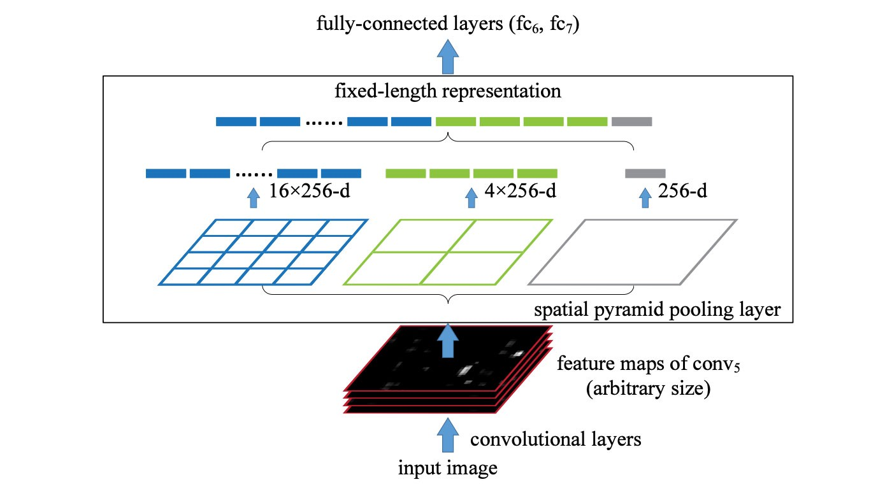

YOLO v5
==============================

This articles is only for personal usages. It is imitated from  the following sorces.
I would like to thank to all of them.

[Source-1](https://jonathan-hui.medium.com/understanding-feature-pyramid-networks-for-object-detection-fpn-45b227b9106c)
[Source-2](https://github.com/WongKinYiu/CrossStagePartialNetworks)
[Source-3](https://pub.towardsai.net/yolo-v5-explained-and-demystified-4e4719891d69)
[Source-4](https://github.com/ultralytics/yolov5)


YOLO v5 is a single-stage object detector. It has three important parts like nay other single-stage object detector:

    1. Model Backboen
    2. Model Neck
    3. Model Head


# Model Backbone

model backbone is mainly used to extract important features from the given input image. 

In Yolo v5 the `csp (Cross Stage Partial Networks)` are used as backbone to extract features from the imput images.

**To understand the Backbone of YOLO** Let's dig with `Dense Block & DenseNet`.

A Dense Block contains multiple convolution layers with each layers Hi composed of `batch normalization`, `ReLu`, and followed by `convolution`. Instead of using the output of the last layer only, Hi takes the output of all previous layers as well as the original as its input. i.e. x₀, x₁, …, and xᵢ₋₁. Each Hi below outputs four feature maps. Therefore, at each layer, the number of feature maps is increased by four — the growth rate ([source](https://jonathan-hui.medium.com/yolov4-c9901eaa8e61)).


Then a DenseNet can be formed by composing multiple Dense Block wuith a transition layers in between that composed of convolution and pooling.


- Detail architecture design


All images [source](https://arxiv.org/pdf/1608.06993.pdf)


# Here comes the CSP

One of the important task of CSP is to separate the input feature maps of the Dense Block into two parts. The first part x₀’ bypasses the DenseBlock and becomes part of the input to the next transition layer. The second part x₀’’ will go thought the Dense block as below.


This new design reduces the computational complexity by separating the input into two parts — with only one going through the Dense Block.


***CSPDarknet53***

YOLOv4 utilizes the CSP connections above with the Darknet-53 below as the backbone in feature extraction.


The CSPDarknet53 model has higher accuracy in object detection compared with ResNet based designs even they have a better classification performance. But the classification accuracy of CSPDarknet53 can be improved with Mish.


# Model Neck


To enrich the information that feeds into the head, neighboring feature maps coming from the bottom-up stream and the top-down stream are added together element-wise or concatenated before feeding into the head. Therefore, the head’s input will contain spatial rich information from the bottom-up stream and the semantic rich information from the top-down stream. This part of the system is called a neck. Let’s get more details in its design.


***In YOLO v5 PANet is used for as neck to get feature pyramids. For more***

**Let's understand more design**

- FPN (Featrure Pyramid Networks)


YOLO v3 adapts a smililar approach as FPN in making object detection predictions at different scale levels. In making predictions for a particular scale, FPN upsamples (2×) the previous top-down stream and add it with the neighboring layer of the bottom-up stream (see the diagram below). The result is passed into a 3×3 convolution filter to reduce upsampling artifacts and create the feature maps P4 below for the head.


- SPP (spatial pyramid pooling layers)

SPP applies a slightly different strategy in detecting objects of different scales. It replaces the last pooling layer (after the last convolutional layer) with a spatial pyramid pooling layer. The feature maps are spatially divided into m×m bins with m, say, equals 1, 2, and 4 respectively. Then a maximum pool is applied to each bin for each channel. This forms a fixed-length representation that can be further analyzed with FC-layers.




Many CNN-based models containing FC-layers and therefore, accepts input images of specific dimensions only. In contrast, SPP accepts images of different sizes. Nevertheless, there are technologies like fully convolution networks (FCN) that contain no FC-layers and accepts images of different dimensions. This type of design is particularly useful for image segmentation which spatial information is important. Therefore, for YOLO, convert 2-D feature maps into a fixed-size 1-D vector is not necessarily desirable.


The diagram below demonstrates how SPP is integrated into YOLO.


- Path Aggregation Network (PAN)

The diagram below is the Path Aggregation Network (PAN) for object detection. A bottom-up path (b) is augmented to make low-layer information easier to propagate to the top. In FPN, the localized spatial information traveled upward in the red arrow. While not clearly demonstrates in the diagram, the red path goes through about 100+ layers. PAN introduced a short-cut path (the green path) which only takes about 10 layers to go to the top N₅ layer. This short-circuit concepts make fine-grain localized information available to top layers.


`Neck design` can be visualized as the following:


In FPN, objects are detected separately and independently at different scale levels. This may produce duplicated predictions and not utilize information from other feature maps. PAN fuses the information together from all layers first using element-wise max operation


The model Head is mainly used to perform the final detection part. It applied anchor boxes on features and generates final output vectors with class probabilities, objectness scores, and bounding boxes.

In YOLO v5 model head is the same as the previous YOLO V3 and V4 versions.


# Bag of Freebies (BoF) for backbone:

Like YOLO v4, YOLO v5 also includes features for backbone, which are :


    1. CutMix and Mosaic data augmentation,
    2. DropBlock regularization, and
    3. Class label smoothing


# Bag of Specials(BoS) for backbone

1. Sigmoid activation,
2. Optimization Function
3. Cost Function or Loss Function


**Activation**

The choice of activation functions is most crucial in any deep neural network. Recently lots of activation functions have been introduced like Leaky ReLU, mish, swish, etc

In YOLO v4 author used mish activation function.  In YOLO v5  authors decided to go with the `Leaky Relu and Sigmoid activation` functions. In YOLO v5 the Leaky ReLU activation function is used in middle/hidden layers and the sigmoid activation function is used in the final detection layer.


We can see from model architecture file as below (smallest model 5s):

```
Focus(
  (conv): Conv(
    (conv): Conv2d(12, 32, kernel_size=(3, 3), stride=(1, 1), padding=(1, 1), bias=False)
    (bn): BatchNorm2d(32, eps=1e-05, momentum=0.1, affine=True, track_running_stats=True)
    (act): LeakyReLU(negative_slope=0.1, inplace=True)
  )
), Conv(
  (conv): Conv2d(32, 64, kernel_size=(3, 3), stride=(2, 2), padding=(1, 1), bias=False)
  (bn): BatchNorm2d(64, eps=1e-05, momentum=0.1, affine=True, track_running_stats=True)
  (act): LeakyReLU(negative_slope=0.1, inplace=True)
), BottleneckCSP(
  (cv1): Conv(
    (conv): Conv2d(64, 32, kernel_size=(1, 1), stride=(1, 1), bias=False)
    (bn): BatchNorm2d(32, eps=1e-05, momentum=0.1, affine=True, track_running_stats=True)
    (act): LeakyReLU(negative_slope=0.1, inplace=True)
  )
  (cv2): Conv2d(64, 32, kernel_size=(1, 1), stride=(1, 1), bias=False)
  (cv3): Conv2d(32, 32, kernel_size=(1, 1), stride=(1, 1), bias=False)
  (cv4): Conv(
    (conv): Conv2d(64, 64, kernel_size=(1, 1), stride=(1, 1), bias=False)
    (bn): BatchNorm2d(64, eps=1e-05, momentum=0.1, affine=True, track_running_stats=True)
    (act): LeakyReLU(negative_slope=0.1, inplace=True)
  )
  (bn): BatchNorm2d(64, eps=1e-05, momentum=0.1, affine=True, track_running_stats=True)
  (act): LeakyReLU(negative_slope=0.1, inplace=True)
  (m): Sequential(
    (0): Bottleneck(
      (cv1): Conv(
        (conv): Conv2d(32, 32, kernel_size=(1, 1), stride=(1, 1), bias=False)
        (bn): BatchNorm2d(32, eps=1e-05, momentum=0.1, affine=True, track_running_stats=True)
        (act): LeakyReLU(negative_slope=0.1, inplace=True)
      )
      (cv2): Conv(
        (conv): Conv2d(32, 32, kernel_size=(3, 3), stride=(1, 1), padding=(1, 1), bias=False)
        (bn): BatchNorm2d(32, eps=1e-05, momentum=0.1, affine=True, track_running_stats=True)
        (act): LeakyReLU(negative_slope=0.1, inplace=True)
      )
    )
  )
), Conv(
  (conv): Conv2d(64, 128, kernel_size=(3, 3), stride=(2, 2), padding=(1, 1), bias=False)
  (bn): BatchNorm2d(128, eps=1e-05, momentum=0.1, affine=True, track_running_stats=True)
  (act): LeakyReLU(negative_slope=0.1, inplace=True)
), BottleneckCSP(
  (cv1): Conv(
    (conv): Conv2d(128, 64, kernel_size=(1, 1), stride=(1, 1), bias=False)
    (bn): BatchNorm2d(64, eps=1e-05, momentum=0.1, affine=True, track_running_stats=True)
    (act): LeakyReLU(negative_slope=0.1, inplace=True)
  )
  (cv2): Conv2d(128, 64, kernel_size=(1, 1), stride=(1, 1), bias=False)
  (cv3): Conv2d(64, 64, kernel_size=(1, 1), stride=(1, 1), bias=False)
  (cv4): Conv(
    (conv): Conv2d(128, 128, kernel_size=(1, 1), stride=(1, 1), bias=False)
    (bn): BatchNorm2d(128, eps=1e-05, momentum=0.1, affine=True, track_running_stats=True)
    (act): LeakyReLU(negative_slope=0.1, inplace=True)
  )
  (bn): BatchNorm2d(128, eps=1e-05, momentum=0.1, affine=True, track_running_stats=True)
  (act): LeakyReLU(negative_slope=0.1, inplace=True)
  (m): Sequential(
    (0): Bottleneck(
      (cv1): Conv(
        (conv): Conv2d(64, 64, kernel_size=(1, 1), stride=(1, 1), bias=False)
        (bn): BatchNorm2d(64, eps=1e-05, momentum=0.1, affine=True, track_running_stats=True)
        (act): LeakyReLU(negative_slope=0.1, inplace=True)
      )
      (cv2): Conv(
        (conv): Conv2d(64, 64, kernel_size=(3, 3), stride=(1, 1), padding=(1, 1), bias=False)
        (bn): BatchNorm2d(64, eps=1e-05, momentum=0.1, affine=True, track_running_stats=True)
        (act): LeakyReLU(negative_slope=0.1, inplace=True)
      )
    )
    (1): Bottleneck(
      (cv1): Conv(
        (conv): Conv2d(64, 64, kernel_size=(1, 1), stride=(1, 1), bias=False)
        (bn): BatchNorm2d(64, eps=1e-05, momentum=0.1, affine=True, track_running_stats=True)
        (act): LeakyReLU(negative_slope=0.1, inplace=True)
      )
      (cv2): Conv(
        (conv): Conv2d(64, 64, kernel_size=(3, 3), stride=(1, 1), padding=(1, 1), bias=False)
        (bn): BatchNorm2d(64, eps=1e-05, momentum=0.1, affine=True, track_running_stats=True)
        (act): LeakyReLU(negative_slope=0.1, inplace=True)
      )
    )
    (2): Bottleneck(
      (cv1): Conv(
        (conv): Conv2d(64, 64, kernel_size=(1, 1), stride=(1, 1), bias=False)
        (bn): BatchNorm2d(64, eps=1e-05, momentum=0.1, affine=True, track_running_stats=True)
        (act): LeakyReLU(negative_slope=0.1, inplace=True)
      )
      (cv2): Conv(
        (conv): Conv2d(64, 64, kernel_size=(3, 3), stride=(1, 1), padding=(1, 1), bias=False)
        (bn): BatchNorm2d(64, eps=1e-05, momentum=0.1, affine=True, track_running_stats=True)
        (act): LeakyReLU(negative_slope=0.1, inplace=True)
      )
    )
  )
), Conv(
  (conv): Conv2d(128, 256, kernel_size=(3, 3), stride=(2, 2), padding=(1, 1), bias=False)
  (bn): BatchNorm2d(256, eps=1e-05, momentum=0.1, affine=True, track_running_stats=True)
  (act): LeakyReLU(negative_slope=0.1, inplace=True)
), BottleneckCSP(
  (cv1): Conv(
    (conv): Conv2d(256, 128, kernel_size=(1, 1), stride=(1, 1), bias=False)
    (bn): BatchNorm2d(128, eps=1e-05, momentum=0.1, affine=True, track_running_stats=True)
    (act): LeakyReLU(negative_slope=0.1, inplace=True)
  )
  (cv2): Conv2d(256, 128, kernel_size=(1, 1), stride=(1, 1), bias=False)
  (cv3): Conv2d(128, 128, kernel_size=(1, 1), stride=(1, 1), bias=False)
  (cv4): Conv(
    (conv): Conv2d(256, 256, kernel_size=(1, 1), stride=(1, 1), bias=False)
    (bn): BatchNorm2d(256, eps=1e-05, momentum=0.1, affine=True, track_running_stats=True)
    (act): LeakyReLU(negative_slope=0.1, inplace=True)
  )
  (bn): BatchNorm2d(256, eps=1e-05, momentum=0.1, affine=True, track_running_stats=True)
  (act): LeakyReLU(negative_slope=0.1, inplace=True)
  (m): Sequential(
    (0): Bottleneck(
      (cv1): Conv(
        (conv): Conv2d(128, 128, kernel_size=(1, 1), stride=(1, 1), bias=False)
        (bn): BatchNorm2d(128, eps=1e-05, momentum=0.1, affine=True, track_running_stats=True)
        (act): LeakyReLU(negative_slope=0.1, inplace=True)
      )
      (cv2): Conv(
        (conv): Conv2d(128, 128, kernel_size=(3, 3), stride=(1, 1), padding=(1, 1), bias=False)
        (bn): BatchNorm2d(128, eps=1e-05, momentum=0.1, affine=True, track_running_stats=True)
        (act): LeakyReLU(negative_slope=0.1, inplace=True)
      )
    )
    (1): Bottleneck(
      (cv1): Conv(
        (conv): Conv2d(128, 128, kernel_size=(1, 1), stride=(1, 1), bias=False)
        (bn): BatchNorm2d(128, eps=1e-05, momentum=0.1, affine=True, track_running_stats=True)
        (act): LeakyReLU(negative_slope=0.1, inplace=True)
      )
      (cv2): Conv(
        (conv): Conv2d(128, 128, kernel_size=(3, 3), stride=(1, 1), padding=(1, 1), bias=False)
        (bn): BatchNorm2d(128, eps=1e-05, momentum=0.1, affine=True, track_running_stats=True)
        (act): LeakyReLU(negative_slope=0.1, inplace=True)
      )
    )
    (2): Bottleneck(
      (cv1): Conv(
        (conv): Conv2d(128, 128, kernel_size=(1, 1), stride=(1, 1), bias=False)
        (bn): BatchNorm2d(128, eps=1e-05, momentum=0.1, affine=True, track_running_stats=True)
        (act): LeakyReLU(negative_slope=0.1, inplace=True)
      )
      (cv2): Conv(
        (conv): Conv2d(128, 128, kernel_size=(3, 3), stride=(1, 1), padding=(1, 1), bias=False)
        (bn): BatchNorm2d(128, eps=1e-05, momentum=0.1, affine=True, track_running_stats=True)
        (act): LeakyReLU(negative_slope=0.1, inplace=True)
      )
    )
  )
), Conv(
  (conv): Conv2d(256, 512, kernel_size=(3, 3), stride=(2, 2), padding=(1, 1), bias=False)
  (bn): BatchNorm2d(512, eps=1e-05, momentum=0.1, affine=True, track_running_stats=True)
  (act): LeakyReLU(negative_slope=0.1, inplace=True)
), SPP(
  (cv1): Conv(
    (conv): Conv2d(512, 256, kernel_size=(1, 1), stride=(1, 1), bias=False)
    (bn): BatchNorm2d(256, eps=1e-05, momentum=0.1, affine=True, track_running_stats=True)
    (act): LeakyReLU(negative_slope=0.1, inplace=True)
  )
  (cv2): Conv(
    (conv): Conv2d(1024, 512, kernel_size=(1, 1), stride=(1, 1), bias=False)
    (bn): BatchNorm2d(512, eps=1e-05, momentum=0.1, affine=True, track_running_stats=True)
    (act): LeakyReLU(negative_slope=0.1, inplace=True)
  )
  (m): ModuleList(
    (0): MaxPool2d(kernel_size=5, stride=1, padding=2, dilation=1, ceil_mode=False)
    (1): MaxPool2d(kernel_size=9, stride=1, padding=4, dilation=1, ceil_mode=False)
    (2): MaxPool2d(kernel_size=13, stride=1, padding=6, dilation=1, ceil_mode=False)
  )
), BottleneckCSP(
  (cv1): Conv(
    (conv): Conv2d(512, 256, kernel_size=(1, 1), stride=(1, 1), bias=False)
    (bn): BatchNorm2d(256, eps=1e-05, momentum=0.1, affine=True, track_running_stats=True)
    (act): LeakyReLU(negative_slope=0.1, inplace=True)
  )
  (cv2): Conv2d(512, 256, kernel_size=(1, 1), stride=(1, 1), bias=False)
  (cv3): Conv2d(256, 256, kernel_size=(1, 1), stride=(1, 1), bias=False)
  (cv4): Conv(
    (conv): Conv2d(512, 512, kernel_size=(1, 1), stride=(1, 1), bias=False)
    (bn): BatchNorm2d(512, eps=1e-05, momentum=0.1, affine=True, track_running_stats=True)
    (act): LeakyReLU(negative_slope=0.1, inplace=True)
  )
  (bn): BatchNorm2d(512, eps=1e-05, momentum=0.1, affine=True, track_running_stats=True)
  (act): LeakyReLU(negative_slope=0.1, inplace=True)
  (m): Sequential(
    (0): Bottleneck(
      (cv1): Conv(
        (conv): Conv2d(256, 256, kernel_size=(1, 1), stride=(1, 1), bias=False)
        (bn): BatchNorm2d(256, eps=1e-05, momentum=0.1, affine=True, track_running_stats=True)
        (act): LeakyReLU(negative_slope=0.1, inplace=True)
      )
      (cv2): Conv(
        (conv): Conv2d(256, 256, kernel_size=(3, 3), stride=(1, 1), padding=(1, 1), bias=False)
        (bn): BatchNorm2d(256, eps=1e-05, momentum=0.1, affine=True, track_running_stats=True)
        (act): LeakyReLU(negative_slope=0.1, inplace=True)
      )
    )
  )
), Conv(
  (conv): Conv2d(512, 256, kernel_size=(1, 1), stride=(1, 1), bias=False)
  (bn): BatchNorm2d(256, eps=1e-05, momentum=0.1, affine=True, track_running_stats=True)
  (act): LeakyReLU(negative_slope=0.1, inplace=True)
), Upsample(scale_factor=2.0, mode=nearest), Concat(), BottleneckCSP(
  (cv1): Conv(
    (conv): Conv2d(512, 128, kernel_size=(1, 1), stride=(1, 1), bias=False)
    (bn): BatchNorm2d(128, eps=1e-05, momentum=0.1, affine=True, track_running_stats=True)
    (act): LeakyReLU(negative_slope=0.1, inplace=True)
  )
  (cv2): Conv2d(512, 128, kernel_size=(1, 1), stride=(1, 1), bias=False)
  (cv3): Conv2d(128, 128, kernel_size=(1, 1), stride=(1, 1), bias=False)
  (cv4): Conv(
    (conv): Conv2d(256, 256, kernel_size=(1, 1), stride=(1, 1), bias=False)
    (bn): BatchNorm2d(256, eps=1e-05, momentum=0.1, affine=True, track_running_stats=True)
    (act): LeakyReLU(negative_slope=0.1, inplace=True)
  )
  (bn): BatchNorm2d(256, eps=1e-05, momentum=0.1, affine=True, track_running_stats=True)
  (act): LeakyReLU(negative_slope=0.1, inplace=True)
  (m): Sequential(
    (0): Bottleneck(
      (cv1): Conv(
        (conv): Conv2d(128, 128, kernel_size=(1, 1), stride=(1, 1), bias=False)
        (bn): BatchNorm2d(128, eps=1e-05, momentum=0.1, affine=True, track_running_stats=True)
        (act): LeakyReLU(negative_slope=0.1, inplace=True)
      )
      (cv2): Conv(
        (conv): Conv2d(128, 128, kernel_size=(3, 3), stride=(1, 1), padding=(1, 1), bias=False)
        (bn): BatchNorm2d(128, eps=1e-05, momentum=0.1, affine=True, track_running_stats=True)
        (act): LeakyReLU(negative_slope=0.1, inplace=True)
      )
    )
  )
), Conv(
  (conv): Conv2d(256, 128, kernel_size=(1, 1), stride=(1, 1), bias=False)
  (bn): BatchNorm2d(128, eps=1e-05, momentum=0.1, affine=True, track_running_stats=True)
  (act): LeakyReLU(negative_slope=0.1, inplace=True)
), Upsample(scale_factor=2.0, mode=nearest), Concat(), BottleneckCSP(
  (cv1): Conv(
    (conv): Conv2d(256, 64, kernel_size=(1, 1), stride=(1, 1), bias=False)
    (bn): BatchNorm2d(64, eps=1e-05, momentum=0.1, affine=True, track_running_stats=True)
    (act): LeakyReLU(negative_slope=0.1, inplace=True)
  )
  (cv2): Conv2d(256, 64, kernel_size=(1, 1), stride=(1, 1), bias=False)
  (cv3): Conv2d(64, 64, kernel_size=(1, 1), stride=(1, 1), bias=False)
  (cv4): Conv(
    (conv): Conv2d(128, 128, kernel_size=(1, 1), stride=(1, 1), bias=False)
    (bn): BatchNorm2d(128, eps=1e-05, momentum=0.1, affine=True, track_running_stats=True)
    (act): LeakyReLU(negative_slope=0.1, inplace=True)
  )
  (bn): BatchNorm2d(128, eps=1e-05, momentum=0.1, affine=True, track_running_stats=True)
  (act): LeakyReLU(negative_slope=0.1, inplace=True)
  (m): Sequential(
    (0): Bottleneck(
      (cv1): Conv(
        (conv): Conv2d(64, 64, kernel_size=(1, 1), stride=(1, 1), bias=False)
        (bn): BatchNorm2d(64, eps=1e-05, momentum=0.1, affine=True, track_running_stats=True)
        (act): LeakyReLU(negative_slope=0.1, inplace=True)
      )
      (cv2): Conv(
        (conv): Conv2d(64, 64, kernel_size=(3, 3), stride=(1, 1), padding=(1, 1), bias=False)
        (bn): BatchNorm2d(64, eps=1e-05, momentum=0.1, affine=True, track_running_stats=True)
        (act): LeakyReLU(negative_slope=0.1, inplace=True)
      )
    )
  )
), Conv2d(128, 255, kernel_size=(1, 1), stride=(1, 1)), Conv(
  (conv): Conv2d(128, 128, kernel_size=(3, 3), stride=(2, 2), padding=(1, 1), bias=False)
  (bn): BatchNorm2d(128, eps=1e-05, momentum=0.1, affine=True, track_running_stats=True)
  (act): LeakyReLU(negative_slope=0.1, inplace=True)
), Concat(), BottleneckCSP(
  (cv1): Conv(
    (conv): Conv2d(256, 128, kernel_size=(1, 1), stride=(1, 1), bias=False)
    (bn): BatchNorm2d(128, eps=1e-05, momentum=0.1, affine=True, track_running_stats=True)
    (act): LeakyReLU(negative_slope=0.1, inplace=True)
  )
  (cv2): Conv2d(256, 128, kernel_size=(1, 1), stride=(1, 1), bias=False)
  (cv3): Conv2d(128, 128, kernel_size=(1, 1), stride=(1, 1), bias=False)
  (cv4): Conv(
    (conv): Conv2d(256, 256, kernel_size=(1, 1), stride=(1, 1), bias=False)
    (bn): BatchNorm2d(256, eps=1e-05, momentum=0.1, affine=True, track_running_stats=True)
    (act): LeakyReLU(negative_slope=0.1, inplace=True)
  )
  (bn): BatchNorm2d(256, eps=1e-05, momentum=0.1, affine=True, track_running_stats=True)
  (act): LeakyReLU(negative_slope=0.1, inplace=True)
  (m): Sequential(
    (0): Bottleneck(
      (cv1): Conv(
        (conv): Conv2d(128, 128, kernel_size=(1, 1), stride=(1, 1), bias=False)
        (bn): BatchNorm2d(128, eps=1e-05, momentum=0.1, affine=True, track_running_stats=True)
        (act): LeakyReLU(negative_slope=0.1, inplace=True)
      )
      (cv2): Conv(
        (conv): Conv2d(128, 128, kernel_size=(3, 3), stride=(1, 1), padding=(1, 1), bias=False)
        (bn): BatchNorm2d(128, eps=1e-05, momentum=0.1, affine=True, track_running_stats=True)
        (act): LeakyReLU(negative_slope=0.1, inplace=True)
      )
    )
  )
), Conv2d(256, 255, kernel_size=(1, 1), stride=(1, 1)), Conv(
  (conv): Conv2d(256, 256, kernel_size=(3, 3), stride=(2, 2), padding=(1, 1), bias=False)
  (bn): BatchNorm2d(256, eps=1e-05, momentum=0.1, affine=True, track_running_stats=True)
  (act): LeakyReLU(negative_slope=0.1, inplace=True)
), Concat(), BottleneckCSP(
  (cv1): Conv(
    (conv): Conv2d(512, 256, kernel_size=(1, 1), stride=(1, 1), bias=False)
    (bn): BatchNorm2d(256, eps=1e-05, momentum=0.1, affine=True, track_running_stats=True)
    (act): LeakyReLU(negative_slope=0.1, inplace=True)
  )
  (cv2): Conv2d(512, 256, kernel_size=(1, 1), stride=(1, 1), bias=False)
  (cv3): Conv2d(256, 256, kernel_size=(1, 1), stride=(1, 1), bias=False)
  (cv4): Conv(
    (conv): Conv2d(512, 512, kernel_size=(1, 1), stride=(1, 1), bias=False)
    (bn): BatchNorm2d(512, eps=1e-05, momentum=0.1, affine=True, track_running_stats=True)
    (act): LeakyReLU(negative_slope=0.1, inplace=True)
  )
  (bn): BatchNorm2d(512, eps=1e-05, momentum=0.1, affine=True, track_running_stats=True)
  (act): LeakyReLU(negative_slope=0.1, inplace=True)
  (m): Sequential(
    (0): Bottleneck(
      (cv1): Conv(
        (conv): Conv2d(256, 256, kernel_size=(1, 1), stride=(1, 1), bias=False)
        (bn): BatchNorm2d(256, eps=1e-05, momentum=0.1, affine=True, track_running_stats=True)
        (act): LeakyReLU(negative_slope=0.1, inplace=True)
      )
      (cv2): Conv(
        (conv): Conv2d(256, 256, kernel_size=(3, 3), stride=(1, 1), padding=(1, 1), bias=False)
        (bn): BatchNorm2d(256, eps=1e-05, momentum=0.1, affine=True, track_running_stats=True)
        (act): LeakyReLU(negative_slope=0.1, inplace=True)
      )
    )
  )
), Conv2d(512, 255, kernel_size=(1, 1), stride=(1, 1)), Detect()


```

**Example of activation functions**

[click](https://medium.com/the-theory-of-everything/understanding-activation-functions-in-neural-networks-9491262884e0)


***Optimization Function**

    1. SGD
    2. Adam


In YOLO v5, the default optimization function for training is SGD.

However, you can change it to Adam by using the “ — — adam” command-line argument.


**For optimization function**
[click](https://www.kdnuggets.com/2020/12/optimization-algorithms-neural-networks.html)


**Cost Function or Loss Functioin**

To understand the loss function [click](https://medium.com/@zeeshanmulla/cost-activation-loss-function-neural-network-deep-learning-what-are-these-91167825a4de)

In the YOLO family, there is a compound loss is calculated based on objectness score, class probability score, and bounding box regression score.

Ultralytics have used Binary Cross-Entropy with Logits Loss function from PyTorch for loss calculation of class probability and object score.

We also have an option to choose the Focal Loss function to calculate the loss. You can choose to train with Focal Loss by using fl_gamma hyper-parameter.

F


In the YOLO family, there is a compound loss is calculated based on objectness score, class probability score, and bounding box regression score.

Ultralytics have used Binary Cross-Entropy with Logits Loss function from PyTorch for loss calculation of class probability and object score.

We also have an option to choose the Focal Loss function to calculate the loss. You can choose to train with Focal Loss by using fl_gamma hyper-parameter.


# Weights, Biases, Parameters, Gradients and Final Model Summary


```
layer                                     name  gradient   parameters                shape         mu      sigma
    0                 model.0.conv.conv.weight      True         3456       [32, 12, 3, 3]  -0.000974     0.0555
    1                   model.0.conv.bn.weight      True           32                 [32]          1          0
    2                     model.0.conv.bn.bias      True           32                 [32]          0          0
    3                      model.1.conv.weight      True        18432       [64, 32, 3, 3]  -4.18e-06     0.0341
    4                        model.1.bn.weight      True           64                 [64]          1          0
    5                          model.1.bn.bias      True           64                 [64]          0          0
    6                  model.2.cv1.conv.weight      True         2048       [32, 64, 1, 1]    0.00111     0.0735
    7                    model.2.cv1.bn.weight      True           32                 [32]          1          0
    8                      model.2.cv1.bn.bias      True           32                 [32]          0          0
    9                       model.2.cv2.weight      True         2048       [32, 64, 1, 1]    0.00191     0.0706
   10                       model.2.cv3.weight      True         1024       [32, 32, 1, 1]   0.000671      0.105
   11                  model.2.cv4.conv.weight      True         4096       [64, 64, 1, 1]   -0.00111     0.0722
   12                    model.2.cv4.bn.weight      True           64                 [64]          1          0
   13                      model.2.cv4.bn.bias      True           64                 [64]          0          0
   14                        model.2.bn.weight      True           64                 [64]          1          0
   15                          model.2.bn.bias      True           64                 [64]          0          0
   16              model.2.m.0.cv1.conv.weight      True         1024       [32, 32, 1, 1]    0.00249      0.101
   17                model.2.m.0.cv1.bn.weight      True           32                 [32]          1          0
   18                  model.2.m.0.cv1.bn.bias      True           32                 [32]          0          0
   19              model.2.m.0.cv2.conv.weight      True         9216       [32, 32, 3, 3]   0.000541     0.0338
   20                model.2.m.0.cv2.bn.weight      True           32                 [32]          1          0
   21                  model.2.m.0.cv2.bn.bias      True           32                 [32]          0          0
   22                      model.3.conv.weight      True        73728      [128, 64, 3, 3]   1.76e-05      0.024
   23                        model.3.bn.weight      True          128                [128]          1          0
   24                          model.3.bn.bias      True          128                [128]          0          0
   25                  model.4.cv1.conv.weight      True         8192      [64, 128, 1, 1]   0.000377      0.051
   26                    model.4.cv1.bn.weight      True           64                 [64]          1          0
   27                      model.4.cv1.bn.bias      True           64                 [64]          0          0
   28                       model.4.cv2.weight      True         8192      [64, 128, 1, 1]  -0.000606     0.0512
   29                       model.4.cv3.weight      True         4096       [64, 64, 1, 1]    0.00171     0.0718
   30                  model.4.cv4.conv.weight      True        16384     [128, 128, 1, 1]  -0.000492     0.0511
   31                    model.4.cv4.bn.weight      True          128                [128]          1          0
   32                      model.4.cv4.bn.bias      True          128                [128]          0          0
   33                        model.4.bn.weight      True          128                [128]          1          0
   34                          model.4.bn.bias      True          128                [128]          0          0
   35              model.4.m.0.cv1.conv.weight      True         4096       [64, 64, 1, 1]   0.000396     0.0723
   36                model.4.m.0.cv1.bn.weight      True           64                 [64]          1          0
   37                  model.4.m.0.cv1.bn.bias      True           64                 [64]          0          0
   38              model.4.m.0.cv2.conv.weight      True        36864       [64, 64, 3, 3]   8.92e-05     0.0241
   39                model.4.m.0.cv2.bn.weight      True           64                 [64]          1          0
   40                  model.4.m.0.cv2.bn.bias      True           64                 [64]          0          0
   41              model.4.m.1.cv1.conv.weight      True         4096       [64, 64, 1, 1]  -0.000793      0.071
   42                model.4.m.1.cv1.bn.weight      True           64                 [64]          1          0
   43                  model.4.m.1.cv1.bn.bias      True           64                 [64]          0          0
   44              model.4.m.1.cv2.conv.weight      True        36864       [64, 64, 3, 3]   -4.6e-05      0.024
   45                model.4.m.1.cv2.bn.weight      True           64                 [64]          1          0
   46                  model.4.m.1.cv2.bn.bias      True           64                 [64]          0          0
   47              model.4.m.2.cv1.conv.weight      True         4096       [64, 64, 1, 1]   -0.00156     0.0725
   48                model.4.m.2.cv1.bn.weight      True           64                 [64]          1          0
   49                  model.4.m.2.cv1.bn.bias      True           64                 [64]          0          0
   50              model.4.m.2.cv2.conv.weight      True        36864       [64, 64, 3, 3]   0.000118      0.024
   51                model.4.m.2.cv2.bn.weight      True           64                 [64]          1          0
   52                  model.4.m.2.cv2.bn.bias      True           64                 [64]          0          0
   53                      model.5.conv.weight      True       294912     [256, 128, 3, 3]   3.48e-05      0.017
   54                        model.5.bn.weight      True          256                [256]          1          0
   55                          model.5.bn.bias      True          256                [256]          0          0
   56                  model.6.cv1.conv.weight      True        32768     [128, 256, 1, 1]  -0.000118      0.036
   57                    model.6.cv1.bn.weight      True          128                [128]          1          0
   58                      model.6.cv1.bn.bias      True          128                [128]          0          0
   59                       model.6.cv2.weight      True        32768     [128, 256, 1, 1]   0.000155      0.036
   60                       model.6.cv3.weight      True        16384     [128, 128, 1, 1]  -0.000236     0.0512
   61                  model.6.cv4.conv.weight      True        65536     [256, 256, 1, 1]  -0.000126     0.0361
   62                    model.6.cv4.bn.weight      True          256                [256]          1          0
   63                      model.6.cv4.bn.bias      True          256                [256]          0          0
   64                        model.6.bn.weight      True          256                [256]          1          0
   65                          model.6.bn.bias      True          256                [256]          0          0
   66              model.6.m.0.cv1.conv.weight      True        16384     [128, 128, 1, 1]   4.78e-05     0.0512
   67                model.6.m.0.cv1.bn.weight      True          128                [128]          1          0
   68                  model.6.m.0.cv1.bn.bias      True          128                [128]          0          0
   69              model.6.m.0.cv2.conv.weight      True       147456     [128, 128, 3, 3]   -9.5e-05      0.017
   70                model.6.m.0.cv2.bn.weight      True          128                [128]          1          0
   71                  model.6.m.0.cv2.bn.bias      True          128                [128]          0          0
   72              model.6.m.1.cv1.conv.weight      True        16384     [128, 128, 1, 1]   0.000529     0.0512
   73                model.6.m.1.cv1.bn.weight      True          128                [128]          1          0
   74                  model.6.m.1.cv1.bn.bias      True          128                [128]          0          0
   75              model.6.m.1.cv2.conv.weight      True       147456     [128, 128, 3, 3]   1.19e-05      0.017
   76                model.6.m.1.cv2.bn.weight      True          128                [128]          1          0
   77                  model.6.m.1.cv2.bn.bias      True          128                [128]          0          0
   78              model.6.m.2.cv1.conv.weight      True        16384     [128, 128, 1, 1]  -0.000837     0.0507
   79                model.6.m.2.cv1.bn.weight      True          128                [128]          1          0
   80                  model.6.m.2.cv1.bn.bias      True          128                [128]          0          0
   81              model.6.m.2.cv2.conv.weight      True       147456     [128, 128, 3, 3]  -1.72e-05      0.017
   82                model.6.m.2.cv2.bn.weight      True          128                [128]          1          0
   83                  model.6.m.2.cv2.bn.bias      True          128                [128]          0          0
   84                      model.7.conv.weight      True  1.17965e+06     [512, 256, 3, 3]   4.82e-06      0.012
   85                        model.7.bn.weight      True          512                [512]          1          0
   86                          model.7.bn.bias      True          512                [512]          0          0
   87                  model.8.cv1.conv.weight      True       131072     [256, 512, 1, 1]   4.52e-05     0.0255
   88                    model.8.cv1.bn.weight      True          256                [256]          1          0
   89                      model.8.cv1.bn.bias      True          256                [256]          0          0
   90                  model.8.cv2.conv.weight      True       524288    [512, 1024, 1, 1]   1.69e-05      0.018
   91                    model.8.cv2.bn.weight      True          512                [512]          1          0
   92                      model.8.cv2.bn.bias      True          512                [512]          0          0
   93                  model.9.cv1.conv.weight      True       131072     [256, 512, 1, 1]   7.29e-05     0.0255
   94                    model.9.cv1.bn.weight      True          256                [256]          1          0
   95                      model.9.cv1.bn.bias      True          256                [256]          0          0
   96                       model.9.cv2.weight      True       131072     [256, 512, 1, 1]    4.7e-05     0.0255
   97                       model.9.cv3.weight      True        65536     [256, 256, 1, 1]   0.000114      0.036
   98                  model.9.cv4.conv.weight      True       262144     [512, 512, 1, 1]  -3.88e-05     0.0255
   99                    model.9.cv4.bn.weight      True          512                [512]          1          0
  100                      model.9.cv4.bn.bias      True          512                [512]          0          0
  101                        model.9.bn.weight      True          512                [512]          1          0
  102                          model.9.bn.bias      True          512                [512]          0          0
  103              model.9.m.0.cv1.conv.weight      True        65536     [256, 256, 1, 1]   2.01e-06     0.0361
  104                model.9.m.0.cv1.bn.weight      True          256                [256]          1          0
  105                  model.9.m.0.cv1.bn.bias      True          256                [256]          0          0
  106              model.9.m.0.cv2.conv.weight      True       589824     [256, 256, 3, 3]   9.44e-06      0.012
  107                model.9.m.0.cv2.bn.weight      True          256                [256]          1          0
  108                  model.9.m.0.cv2.bn.bias      True          256                [256]          0          0
  109                     model.10.conv.weight      True       131072     [256, 512, 1, 1]   0.000139     0.0255
  110                       model.10.bn.weight      True          256                [256]          1          0
  111                         model.10.bn.bias      True          256                [256]          0          0
  112                 model.13.cv1.conv.weight      True        65536     [128, 512, 1, 1]  -7.31e-05     0.0255
  113                   model.13.cv1.bn.weight      True          128                [128]          1          0
  114                     model.13.cv1.bn.bias      True          128                [128]          0          0
  115                      model.13.cv2.weight      True        65536     [128, 512, 1, 1]  -0.000195     0.0255
  116                      model.13.cv3.weight      True        16384     [128, 128, 1, 1]   0.000736     0.0512
  117                 model.13.cv4.conv.weight      True        65536     [256, 256, 1, 1]   3.61e-05     0.0362
  118                   model.13.cv4.bn.weight      True          256                [256]          1          0
  119                     model.13.cv4.bn.bias      True          256                [256]          0          0
  120                       model.13.bn.weight      True          256                [256]          1          0
  121                         model.13.bn.bias      True          256                [256]          0          0
  122             model.13.m.0.cv1.conv.weight      True        16384     [128, 128, 1, 1]   -0.00021     0.0511
  123               model.13.m.0.cv1.bn.weight      True          128                [128]          1          0
  124                 model.13.m.0.cv1.bn.bias      True          128                [128]          0          0
  125             model.13.m.0.cv2.conv.weight      True       147456     [128, 128, 3, 3]  -7.71e-06      0.017
  126               model.13.m.0.cv2.bn.weight      True          128                [128]          1          0
  127                 model.13.m.0.cv2.bn.bias      True          128                [128]          0          0
  128                     model.14.conv.weight      True        32768     [128, 256, 1, 1]    0.00012      0.036
  129                       model.14.bn.weight      True          128                [128]          1          0
  130                         model.14.bn.bias      True          128                [128]          0          0
  131                 model.17.cv1.conv.weight      True        16384      [64, 256, 1, 1]   3.58e-06     0.0361
  132                   model.17.cv1.bn.weight      True           64                 [64]          1          0
  133                     model.17.cv1.bn.bias      True           64                 [64]          0          0
  134                      model.17.cv2.weight      True        16384      [64, 256, 1, 1]   0.000523     0.0361
  135                      model.17.cv3.weight      True         4096       [64, 64, 1, 1]   -0.00101     0.0728
  136                 model.17.cv4.conv.weight      True        16384     [128, 128, 1, 1]   0.000713     0.0511
  137                   model.17.cv4.bn.weight      True          128                [128]          1          0
  138                     model.17.cv4.bn.bias      True          128                [128]          0          0
  139                       model.17.bn.weight      True          128                [128]          1          0
  140                         model.17.bn.bias      True          128                [128]          0          0
  141             model.17.m.0.cv1.conv.weight      True         4096       [64, 64, 1, 1]   -0.00105     0.0725
  142               model.17.m.0.cv1.bn.weight      True           64                 [64]          1          0
  143                 model.17.m.0.cv1.bn.bias      True           64                 [64]          0          0
  144             model.17.m.0.cv2.conv.weight      True        36864       [64, 64, 3, 3]   9.16e-05      0.024
  145               model.17.m.0.cv2.bn.weight      True           64                 [64]          1          0
  146                 model.17.m.0.cv2.bn.bias      True           64                 [64]          0          0
  147                          model.18.weight      True        32640     [255, 128, 1, 1]  -0.000399     0.0512
  148                            model.18.bias      True          255                [255]      -4.67       1.06
  149                     model.19.conv.weight      True       147456     [128, 128, 3, 3]   2.95e-06     0.0171
  150                       model.19.bn.weight      True          128                [128]          1          0
  151                         model.19.bn.bias      True          128                [128]          0          0
  152                 model.21.cv1.conv.weight      True        32768     [128, 256, 1, 1]  -5.61e-05     0.0362
  153                   model.21.cv1.bn.weight      True          128                [128]          1          0
  154                     model.21.cv1.bn.bias      True          128                [128]          0          0
  155                      model.21.cv2.weight      True        32768     [128, 256, 1, 1]  -5.82e-06      0.036
  156                      model.21.cv3.weight      True        16384     [128, 128, 1, 1]  -0.000378     0.0508
  157                 model.21.cv4.conv.weight      True        65536     [256, 256, 1, 1]   3.53e-05      0.036
  158                   model.21.cv4.bn.weight      True          256                [256]          1          0
  159                     model.21.cv4.bn.bias      True          256                [256]          0          0
  160                       model.21.bn.weight      True          256                [256]          1          0
  161                         model.21.bn.bias      True          256                [256]          0          0
  162             model.21.m.0.cv1.conv.weight      True        16384     [128, 128, 1, 1]  -0.000496     0.0512
  163               model.21.m.0.cv1.bn.weight      True          128                [128]          1          0
  164                 model.21.m.0.cv1.bn.bias      True          128                [128]          0          0
  165             model.21.m.0.cv2.conv.weight      True       147456     [128, 128, 3, 3]   2.96e-06      0.017
  166               model.21.m.0.cv2.bn.weight      True          128                [128]          1          0
  167                 model.21.m.0.cv2.bn.bias      True          128                [128]          0          0
  168                          model.22.weight      True        65280     [255, 256, 1, 1]    0.00018     0.0361
  169                            model.22.bias      True          255                [255]      -4.66       1.04
  170                     model.23.conv.weight      True       589824     [256, 256, 3, 3]     -4e-06      0.012
  171                       model.23.bn.weight      True          256                [256]          1          0
  172                         model.23.bn.bias      True          256                [256]          0          0
  173                 model.25.cv1.conv.weight      True       131072     [256, 512, 1, 1]  -0.000111     0.0255
  174                   model.25.cv1.bn.weight      True          256                [256]          1          0
  175                     model.25.cv1.bn.bias      True          256                [256]          0          0
  176                      model.25.cv2.weight      True       131072     [256, 512, 1, 1]  -6.68e-05     0.0255
  177                      model.25.cv3.weight      True        65536     [256, 256, 1, 1]  -6.19e-05      0.036
  178                 model.25.cv4.conv.weight      True       262144     [512, 512, 1, 1]  -4.93e-05     0.0255
  179                   model.25.cv4.bn.weight      True          512                [512]          1          0
  180                     model.25.cv4.bn.bias      True          512                [512]          0          0
  181                       model.25.bn.weight      True          512                [512]          1          0
  182                         model.25.bn.bias      True          512                [512]          0          0
  183             model.25.m.0.cv1.conv.weight      True        65536     [256, 256, 1, 1]  -0.000234     0.0361
  184               model.25.m.0.cv1.bn.weight      True          256                [256]          1          0
  185                 model.25.m.0.cv1.bn.bias      True          256                [256]          0          0
  186             model.25.m.0.cv2.conv.weight      True       589824     [256, 256, 3, 3]  -3.09e-06      0.012
  187               model.25.m.0.cv2.bn.weight      True          256                [256]          1          0
  188                 model.25.m.0.cv2.bn.bias      True          256                [256]          0          0
  189                          model.26.weight      True       130560     [255, 512, 1, 1]   -7.6e-05     0.0255
  190                            model.26.bias      True          255                [255]      -4.64       1.04

```


Train custom data instruction
==================================

```
#Training command


$ python3 train.py --batch 19 --epochs 300 --data ./data/train_5classes.yaml --cfg ./models/customer_yolov5l_5classes.yaml --weights yolov5l.pt --name 5classes_yolov5l --nosave --cache
# avoid auto anchor by adding this line in training command

python train.py --noautoanchor


# test.py can evaluate mAP on train, val, or test part of a dataset with the --task option

python test.py --data data.yaml --task test
```


https://jonathan-hui.medium.com/yolov4-c9901eaa8e61
https://towardsai.net/p/computer-vision/yolo-v5%E2%80%8A-%E2%80%8Aexplained-and-demystified
https://arxiv.org/pdf/2004.10934.pdf
https://arxiv.org/pdf/1608.06993.pdf
https://www.analyticsvidhya.com/blog/2020/01/fundamentals-deep-learning-activation-functions-when-to-use-them/
https://arxiv.org/pdf/1803.01534.pdf
https://arxiv.org/pdf/1911.11929.pdf
https://arxiv.org/pdf/1612.03144.pdf
