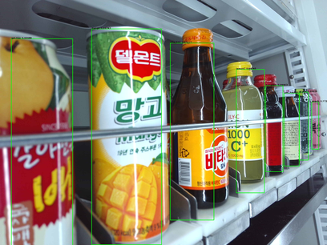

# Object detection with YOLOv3-darknet in custom data


## Install darknet frame work 
```
$  git clone https://github.com/pjreddie/darknet.git
$  cd darknet
```
##  edit makefile : GPU, Opencv, CUDNN
```
$  make

```


--------------------------------------------------------------------

###### Prepare data
- Collect images
- Collect annotation files in .txt format corresponding to images
 ```
 $  python3 convert.py
 ```
- Split train and test images. eg. test.txt & train.txt format.
```
$  python3 split.py
```

## Prepare  following files:

1. object.names

This file containes all the classes.Write each name in new line: eg.


vita

daily_c

pepsi


 
2. trainer.data 

This file contains following lines: 

```
classes=8 # number of labels
train=./train.txt   # path to train.txt
valid=./test.txt   # path to test.txt
names=./object.names   #path to .names
backup=./backup/    # path to save models
```

---------------------------------------------------------------------------------------------

## Download darknet weight

eg. darknet53.conv.74 

Run:
```
wget https://pjreddie.com/media/files/yolov3.weights
```
------------------------------------------------------------------------------------------


## confirm directory as below:

e.g.

```
darknet-  - backup
          - cfg
          - examples
          -images  # keep images in this folder 
          -labels  # Keep labels in this folder (label must be in .txt format)
          - ......
          - custom - darknet weight
                   - objects.names
                   - trainer.data
                   - test.txt 
                   - train.txt
          - .....
          - .....          
 ```                                                  
------------------------------------------------------------------------------------------------------------  
                                         
## Edit .cfg file 

###### Go to darknet - cfg - 

1. Step 1

###### If yolov3.cfg


- Line 3: set batch=24, this means we will be using 24 images for every training step
- Line 4: set subdivisions=8, the batch will be divided by 8 to decrease GPU VRAM requirements.
- Line 603: set filters=(classes + 5)*3 
- Line 610: set classes=15, the number of classes in our training
- Line 689: set filters=(classes + 5)*3 
- Line 696: set classes=15, the number of classes in our training
- Line 776: set filters=(classes + 5)*3 
- Line 783: set classes=15, the number of classes in our training


2. Step 2 

###### If yolov3-tiny.cfg


- Line 3: set batch=24, 
- Line 4: set subdivisions=8 
- Line 127: set filters=(classes + 5)*3 
- Line 135: set classes=15 
- Line 171: set filters=(classes + 5)*3 
- Line 177: set classes=15


------------------------------------------------------------------------------------------------------------


## Taining data
###### copy and paste given comand after editing file paths
```
$ ./darknet detector train custom/trainer.data cfg/yolov3.cfg darknet53.conv.74(this is weight name) flow --lr 0.0005 --gpus 0,1,2
```
###### To use learning rate in command
```
$  ./darknet detector train custome/##.data cfg/yolov3.cfg darknet53.conv.74(this is weight name) -clear 1 flow --lr 0.0005

```

-------------------------------------------------------------------------------------------


##  Test
```
$ ./darknet detector test trainer.data cfg/yolov3.cfg backup/yolov3_2900.weights test_img/12.jpg
# with thres
$ ./darknet detect cfg/yolov3.cfg yolov3.weights data/dog.jpg -thresh 0
 
``` 
###### To test a folder with images then just run the file test.py
```
$ python test.py 
$ python test_1.py 


```

(don't forget to edit necessary parts)


## Result



Class | prediction
--- | ---
mango | 100%
gal_bae | 100%
peach | 73%
grape | 100%
gas_hwal | 100%
hongsam | 100%
lemonC | 100%
vita_500 | 98%


## Detect live 

```
$ ./darknet detector demo custom/trainer.data cfg/yolov3.cfg model/backup/yolov3_80000.weights
```

To use thresh:

-Add flag `-thresh 0.25` at the end of the above command 

-For external camera,  -c <> (-c 1 for camera 1)


or


```
$ python video_detect.py
```


---------------------------------------------------------------------------------------------------------------

# References

<https://pjreddie.com/darknet/yolo/>

<https://github.com/AlexeyAB/darknet>

<https://github.com/pjreddie/darknet/wiki/YOLO:-Real-Time-Object-Detection>
                                          
                                                   


                   


