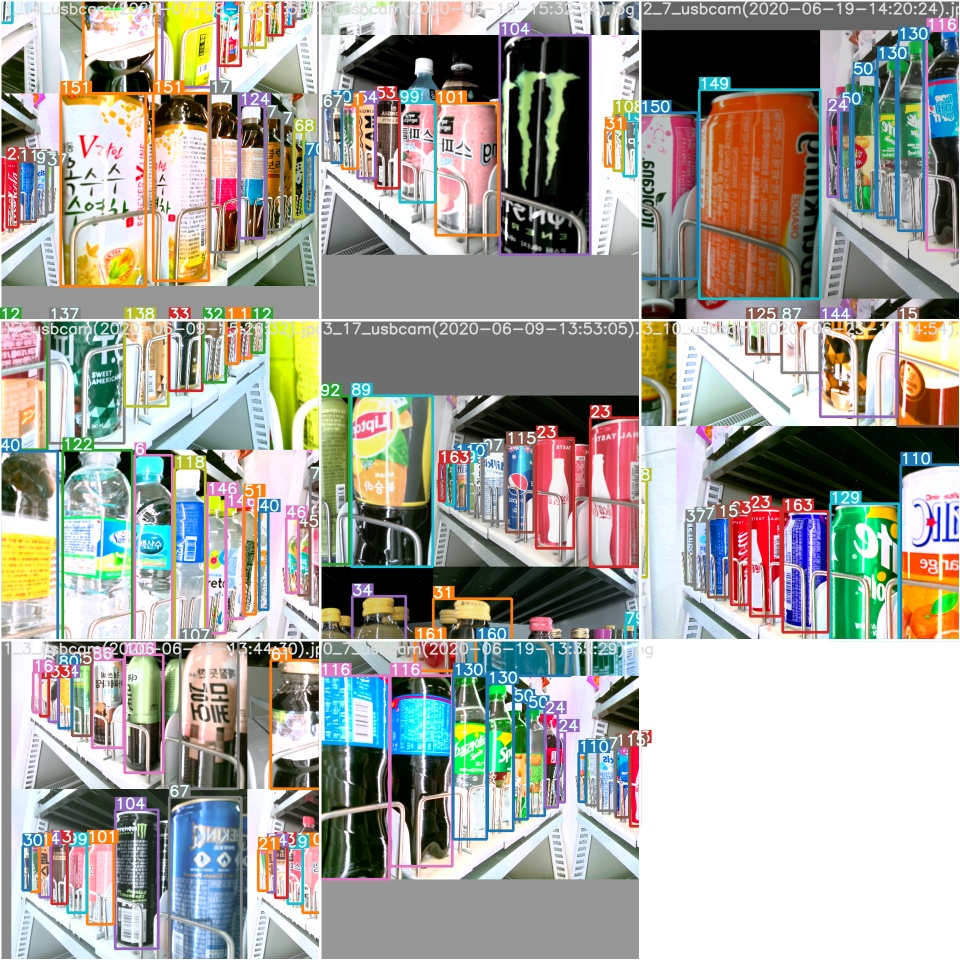
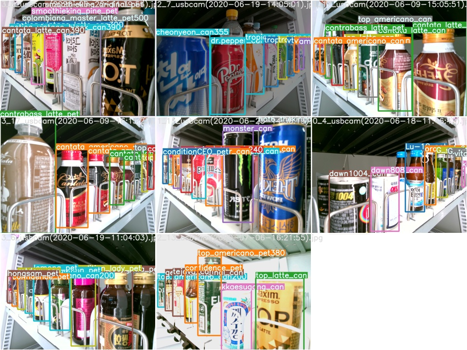

Object detection on custom datatset based on https://github.com/ultralytics/yolov5.git.


## Requirements

```
$ git clone https://github.com/ultralytics/yolov5.git
```


Python 3.7 or later with all `requirements.txt` dependencies installed, including `torch >= 1.5`. To install run:
```bash
$ pip install -U -r requirements.txt
```


## Tutorials

* Data collection

Collect images(`.jpg or .png`) and annotaions (`.xml`) files

* Convert data to yolo format


  - i.e. `.xml` file need to convert to `.txt` file   

  ```
  <object-class> <x> <y> <width> <height>
  ```
  - Move all images and annotations files to `-custom-images/ labels`
  - In folder `custom`, run `$ python convert_xml_to_txt.py` which creates `.txt` file inside of `labels` folder (keep only `.txt` files in `labels` folder)

* Prepare `train.txt` and `val.txt` files

  - In folder `custom`, run `$ python split.py` 

* Copy `coco128.yaml` file to `custom` folder and edit it according to custom dataset

* Check directory:

```
yolov5  - custom ---- images - '.jpg' # images
                    - labels - '.txt' # annotations
                    - coco128.yaml
                    - convert_xml_to_txt.py
                    - split.py
        
        - data
         - inference 
        - models
        - ...
        - ...
        - test.py
        - train.py
```

## Training

```
$ python train.py --data ./custom/coco128.yaml --cfg ./model/yolov5s.yaml --weights '' --batch-size 64 --device 0,1,2
                                                             yolov5m                                48
                                                             yolov5l                                32
                                                             yolov5x                                16
```

---------------------------------------------------------------------------------------------------------------------------------------------

## If training goes well, it generates test and training files in home directory:

  


## Inference

Inference can be run on most common media formats. Model [checkpoints](https://drive.google.com/open?id=1Drs_Aiu7xx6S-ix95f9kNsA6ueKRpN2J) are downloaded automatically if available. Results are saved to `./inference/output`.
```bash
$ python detect.py --source file.jpg  # image 
                            file.mp4  # video
                            ./dir  # directory
                            0  # webcam
                            rtsp://170.93.143.139/rtplive/470011e600ef003a004ee33696235daa  # rtsp stream
                            http://112.50.243.8/PLTV/88888888/224/3221225900/1.m3u8  # http stream
```


To run inference on examples in the `./inference/images` folder:

```bash
$ python detect.py --source ./inference/images/ --weights yolov5s.pt --conf 0.4 --iou o.5 --device 0,1,2

Namespace(agnostic_nms=False, augment=False, classes=None, conf_thres=0.4, device='', fourcc='mp4v', half=False, img_size=640, iou_thres=0.5, output='inference/output', save_txt=False, source='./inference/images/', view_img=False, weights='yolov5s.pt')
Using CUDA device0 _CudaDeviceProperties(name='Tesla P100-PCIE-16GB', total_memory=16280MB)
```
---------------------------------------------------------------------------------------------------------------------------------------------------
## References
- https://github.com/ultralytics/yolov5
- https://pjreddie.com/darknet/yolo/


