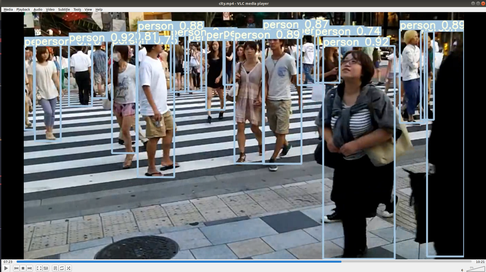

People Tracking 
============

Object tracking is a field within computer vision that involves tracking and detecting objects as they move across several video frames. Both detection and tracking people are challenging problems. Especially in complex real world scenes that commonly involve multiple people, complicated occlusions and cluttered or even moving backgrounds. 


<table border="0">
   <tr>
      <td>
      
      </td>
     </tr>
   </table>


In this project, I tried to use `YOLO-V5 PyTorch` framework to track pedestrains. 

Table of contents
==================

<!--ts-->
* [Data-Collection](#Data-Collection)
     * [Annotation](#Annotation)
     * [Augmentation](#Augmentation)
* [Framework](#Framework)
* [Training](#Traing)
* [Result](#Result)
* [References](#References)


<!--te-->

Data-Collection
================
Data collection, Data pre-processing task are eccential in every Deep learning project. In this project, I collected around 1000 images from different areas such as street, park, library, class room. 


Annotation
===========

Another main task is labeling every object of the images. Since I requaried one class (i.e. `person` ), I use [`lablemg`](https://github.com/tzutalin/labelImg) api to annotate my images. Sample of annotation files and image is given below:

**Sample of `.xml` file**

```
<annotation>
	<folder>img</folder>
	<filename>1.jpg</filename>
	<path>/home/sudip/Desktop/anotation/img/1.jpg</path>
	<source>
		<database>Unknown</database>
	</source>
	<size>
		<width>3264</width>
		<height>2448</height>
		<depth>3</depth>
	</size>
	<segmented>0</segmented>
	<object>
		<name>person</name>
		<pose>Unspecified</pose>
		<truncated>0</truncated>
		<difficult>0</difficult>
		<bndbox>
			<xmin>220</xmin>
			<ymin>1135</ymin>
			<xmax>408</xmax>
			<ymax>1441</ymax>
		</bndbox>
	</object>
</annotation>
```

**Sample of annotation image**

<table border="0">
   <tr>
      <td>
      
      </td>
   </tr>
</table>


Augmentation
=============
Limited data is a major obstacle in applying deep learning models like CNN. If the model learns from a few example of a given class, it is likely to predict the class invalidation and test applications. 

There are many ways to address complications associated with limited data in machine learning. Image augmentation is one useful techinique in building CNN that can increase the size of the training set without acquiring new images.

In this project, I used `albumentations` to generate more images and corresponding `annotation files` by applying following hyperparameters.

```
from albumentations import(
    BboxParams,
    HorizontalFlip,
    VerticalFlip,
    Resize,
    CenterCrop,
    RandomCrop,
    Crop,
    Compose,
    RandomContrast,
    RandomBrightness,
    IAASharpen,
    MotionBlur,
    OneOf)

def get_aug(min_area=0., min_visibility=0.):
    return Compose(
        OneOf([
        RandomContrast(p=0.2, limit=(-0.5,1)),   # -0.5 ~ 2 -- RandomBrightnessContrast
        RandomBrightness(p=0.3, limit=(-0.2,0.1)),
        HorizontalFlip(p=0.6),
        ], p=0.8),

        bbox_params=BboxParams(format='pascal_voc', min_area=min_area, 
                               min_visibility=min_visibility, label_fields=['category_id'])
                               
    )
```

```
##Import libraries
import os
import numpy as np
import cv2
import glob
import xml.etree.ElementTree as ET
from xml.dom import minidom
```

**To get the bounding boxes**

```
def get_boxes(label_path):
    # print(label_path)
    xml_path = os.path.join(label_path)

    root_1 = minidom.parse(xml_path)  # xml.dom.minidom.parse(xml_path)
    bnd_1 = root_1.getElementsByTagName('bndbox')
    names = root_1.getElementsByTagName('name')
    
    result = []
    name_list = []
    category_id = []

    for i in range(len(bnd_1)):
        xmin = int(bnd_1[i].childNodes[1].childNodes[0].nodeValue)
        ymin = int(bnd_1[i].childNodes[3].childNodes[0].nodeValue)
        xmax = int(bnd_1[i].childNodes[5].childNodes[0].nodeValue)
        ymax = int(bnd_1[i].childNodes[7].childNodes[0].nodeValue)

        result.append((xmin,ymin,xmax,ymax))

        name_list.append(names[i].childNodes[0].nodeValue)

        category_id.append(i)
    
```

for more information [click here](https://github.com/Laudarisd/Project_Root/blob/master/Data-preprocessing/Image-Augmentation-with-bounding-box/augmentations_with_bbox.py)


Framework
===========

After finishing the `data preparation` task, we can run the training. Inside of [`Framework`](https://github.com/Laudarisd/People_Tracking/tree/master/Framework) folder all the required information are given.

After installing required `libraries` and editing necessary parts we can run the  training.

```
root@2af60c98e769:/data/yolov5# python3 train.py --data ./path to yaml file  --cfg ./path to model `5x.yaml` --weights '' --batch-size 4 --device 0,1,2,3
```


Training
=============

If everything is okay, it must show `epoch` and other images in the running directory.

**Sample image of `runing training` and graphical view of `class, objectness`**


<table border="0">
   <tr>
      <td>
      
      </td>
      <td>
      
      </td>
   </tr>
</table>


**Sample images of training files**


<table border="0">
   <tr>
      <td>
      
      </td>
      <td>
      
      </td>
      <td>
      
      </td>
   </tr>
   </table>


Result
=======

If the training goes well, models will be saved in `runs` folder. Similarly the graph which includes `IoU`, `Precision`, `Recal`, `mAP`, and `val` will also be saved in the same folder. 

In this section, we can see some results based on my model.

**Result on ubuntu terminal and graph**

<table border="0">
   <tr>
      <td>
      
      </td>
      <td>
      
      </td>
   </tr>
</table>


**Result images with bounding boxes**


<table border="0">
   <tr>
      <td>
      
      </td>
      <td>
      
      </td>
      <td>
      
      </td>
      <td>
      
      </td>
   </tr>
   </table>


Test
=====

To test the model in test data, need to run the command :

**For live cam**

```
$ python3 detect.py --source 0 --weights ./weights/best.pt --conf 0.5 --iou 0.6 --device 0 

```

**For video**

```
$ python3 detect.py --source ./inference/video/ 'video file --weights ./weights/best.pt --conf 0.5 --iou 0.6 --device 0 

```
**Sample video with bounding boxes on ojects**

[Demo video](https://www.youtube.com/watch?v=a7xQ0Zo8IEA)


**For images**

```
$ python3 detect.py --source ./inference/ 'image path' --weights ./weights/best.pt --conf 0.5 --iou 0.6 --device 0 

```


<table border="0">
   <tr>
      <td>
      
      </td>
      <td>
      
      </td>
     </tr>
   </table>


References
=============

* https://github.com/ultralytics/yolov5
* https://github.com/sgrvinod/a-PyTorch-Tutorial-to-Object-Detection


 
 
 
